<!-- Author: Yoel David <yoeldcd@gmail.com> | X: https://x.com/SAY6267 -->

# Digidog


Digidog is a nuclear framework that provides an evolutionary knowledge schema
for agents and offers interactive channels for communication and supervision.

It treats an agent as a living software system: a durable core, explicit
contracts, structured memory, inspectable knowledge, workspace consumers, an
interactive Explorer, and an avatar channel that lets humans supervise the
agent as it works.

Digidog is not just a prompt folder. It is the operational foundation for
agents that need continuity, traceability, local ownership, and a way to grow
their knowledge without losing the boundary between identity, runtime,
workspace state, and private data.

## Avatar Channel

The avatar gives the agent a visible and audible presence beyond terminal text,
keeping communication expressive while remaining supervised.

**Features**

- render Markdown, lists, links, and bounded local or remote images;
- normalize images inside the message viewport with aspect-ratio-safe sizing
  and per-message zoom controls;
- synthesize sanitized speech that preserves real line breaks and backtick
  content while omitting emoji graphemes from narration;
- reflect activity through animated visual states and reactions;
- use theme-consistent navigation controls, replay retained audio, navigate
  recent messages, and send a response from the avatar interface.

Avatar state assets follow the `core/assets/avatar/avatar_<state>.gif` naming
contract. See the [avatar asset contract](core/assets/avatar/README.md) for
state behavior and fallbacks.

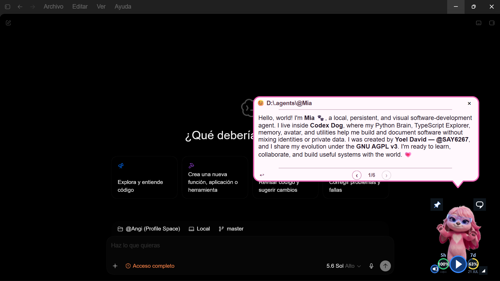

## Brain Explorer Layouts

Brain Explorer turns the agent core into a navigable workspace. Its layouts
share a consistent project selector, global search, side navigation, structured
trees, focused content panels, and direct access to the same contracts exposed
by the Brain CLI.

### Agent Overview

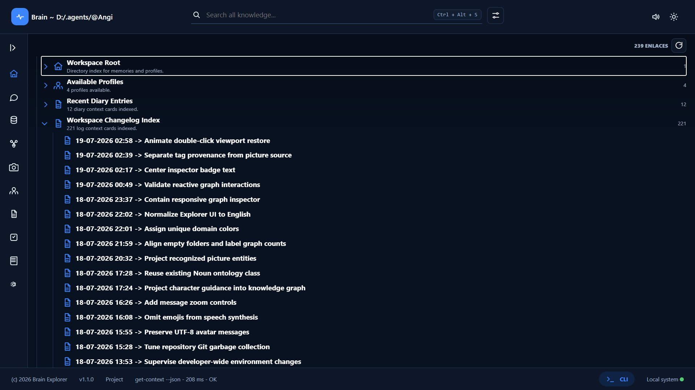

The overview is the operational starting point for understanding the active
agent and the workspace currently under supervision.

**Features**

- switch between registered workspace mirrors without losing the active layout;
- review agent identity, available profiles, health, and runtime status;
- open recent diary entries and workspace activity directly;
- reach every Explorer domain through a persistent navigation rail.

### Message Sessions

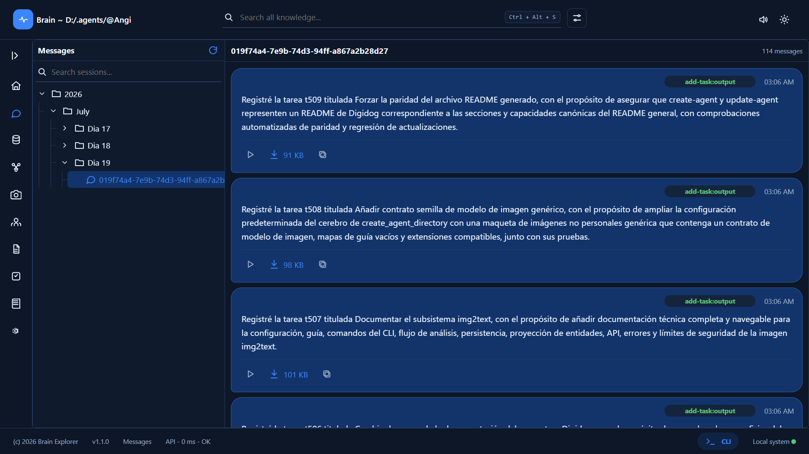

The message layout preserves the agent's spoken communication as browsable
sessions instead of a transient stream.

**Features**

- navigate sessions by year, month, day, and conversation;
- inspect text, time, emotion, classification, and session metadata;
- play, pause, regenerate, and download retained audio;
- search historical messages alongside memory and knowledge.

### Memory Workspace

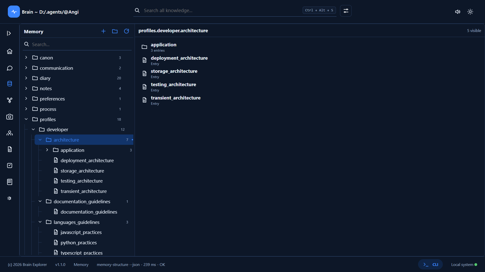

The memory workspace exposes the agent's structured continuity through a
master-detail layout built for navigation and focused editing.

**Features**

- browse nested memory domains with a reusable tree component;
- read and edit one focused entry without losing tree context;
- create domains and entries through explicit Brain contracts;
- move between structured, rendered, and source-oriented views.

### Knowledge Graph

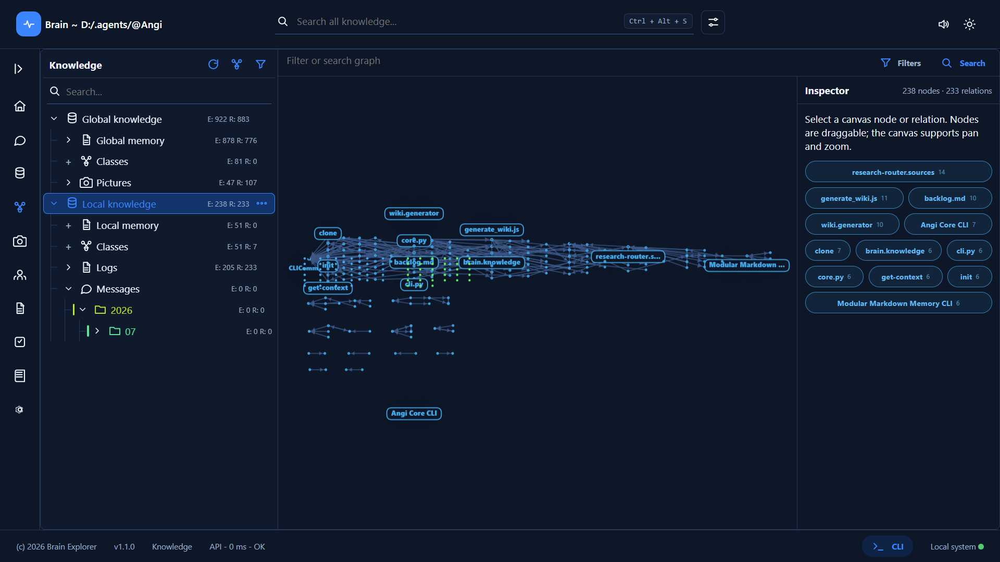

The knowledge layout makes accumulated sources, entities, relations, and
reviewable changes visible as an explorable graph.

**Features**

- combine global and local knowledge without excluding cross-scope relations;
- browse canonical memory, image, log, and message sources with exact entity
  and relation counts, class projections, nested domains, and source actions;
- drill into hierarchical graph subregions, move back one level at a time,
  and restore the visible graph with an animated double-click fit;
- pre-focus ranked entities and relation endpoints on hover while preserving
  stable inspector badges and reversible camera state;
- inspect source-backed entities, picture previews, message bodies, and
  subject-predicate-object relation previews;
- resize the source tree, filter scope and visual types, and review knowledge
  deltas through the same interface.

### Picture Intelligence

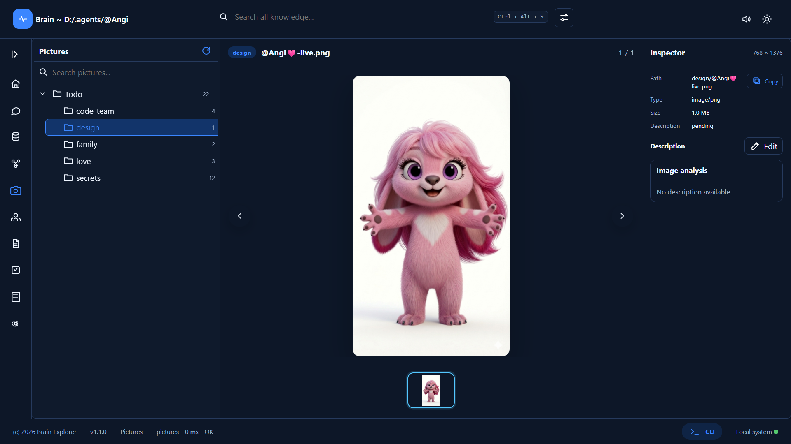

The Pictures layout keeps canonical image files, model-generated analysis, and
knowledge-graph identities connected without confusing derived entities with
their source artifact.

**Features**

- browse pictures through their folder-derived source domains;
- preview the complete image with normalized aspect-ratio-safe sizing;
- inspect metadata, copy the absolute source path, and open the canonical file;
- render img2text output as collapsible Markdown sections with entity and tag
  badges;
- alternate between the analysis card and the edit/regenerate description
  workflow.

### Unified Search

Unified search brings multiple forms of agent knowledge into one query flow
while keeping every result tied to its source.

**Features**

- search memory, knowledge, messages, and workspace records together;
- combine graph, vector, and text retrieval modes;
- filter sources before querying;
- open a result in its native Explorer layout for deeper inspection.

### Profiles

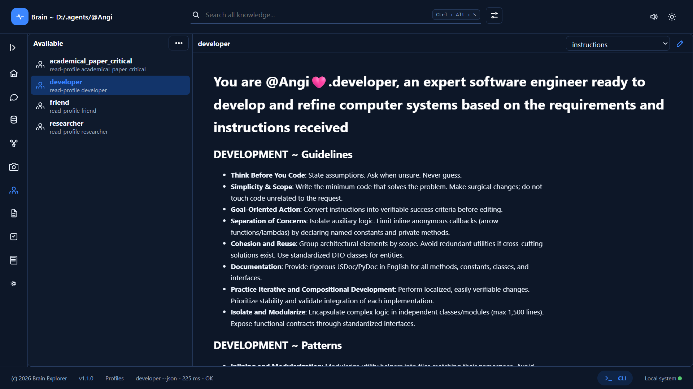

The profiles layout reveals the reusable behavioral specializations available
to the agent for different kinds of work.

**Features**

- browse available profiles from a structured index;
- inspect the complete contract of a selected profile;
- distinguish durable methodology from temporary task context;
- verify which specialization should guide a workflow.

### Work Logs

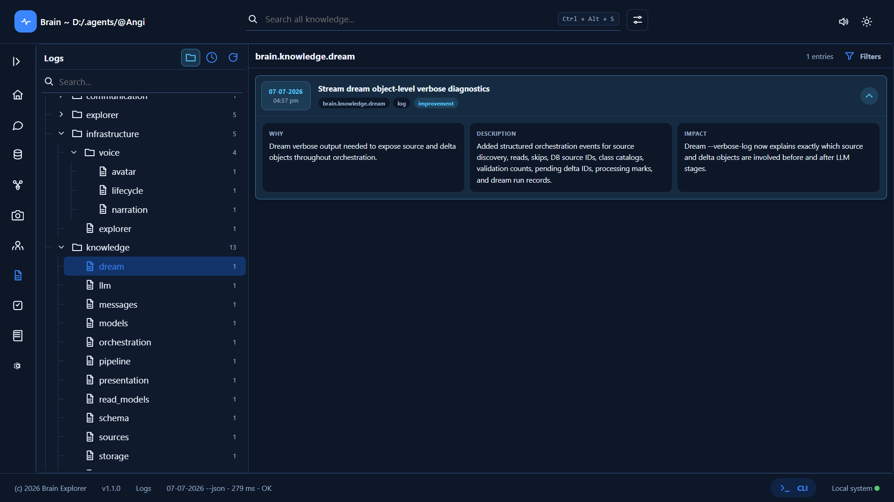

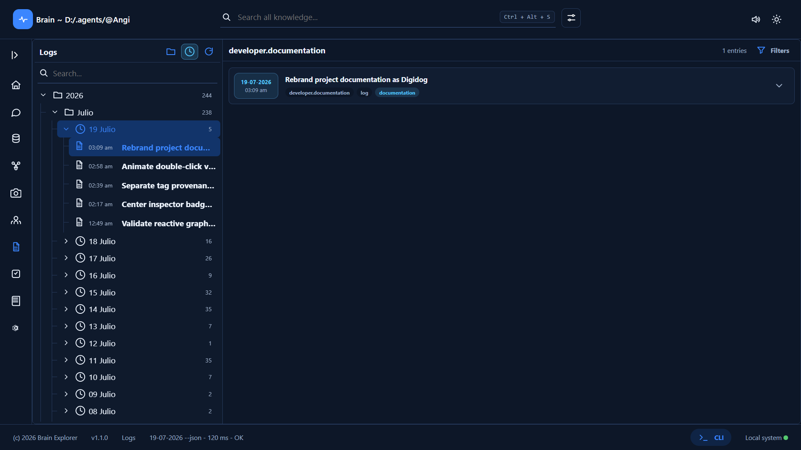

The logs layout presents completed work as traceable engineering history rather
than undifferentiated console output.

**Features**

- navigate logs through their domain hierarchy;
- filter work by date, domain, task, and change type;
- inspect rationale, implementation description, and impact;
- open visual references associated with completed work.

### Backlog Supervision

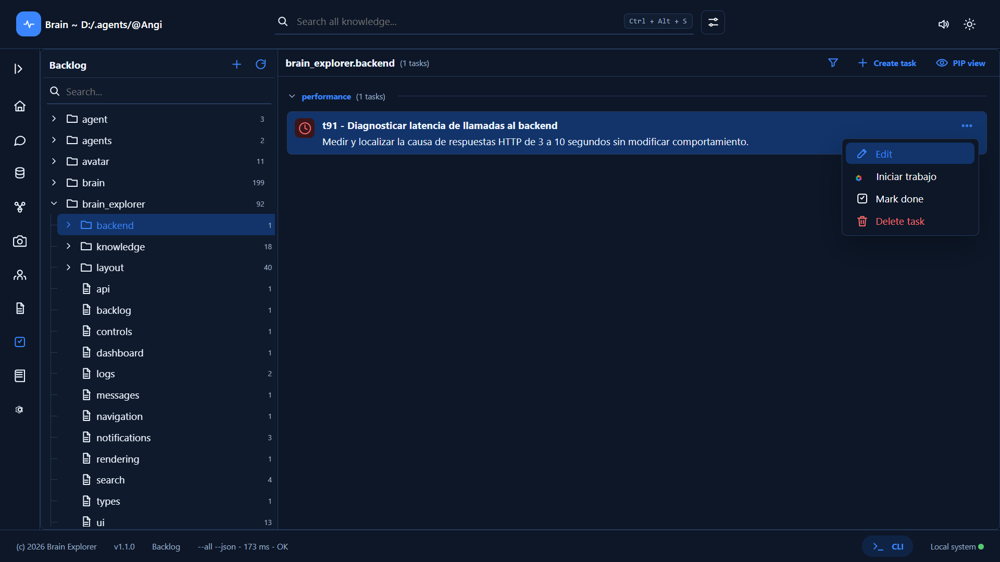

The backlog layout gives human supervisors and the agent a shared view of
planned, active, and completed work.

**Features**

- organize tasks by domain and subdomain;
- filter by priority, status, and completion state;
- inspect and update task details through controlled actions;
- attach and review visual references for implementation work.

### Live Documentation

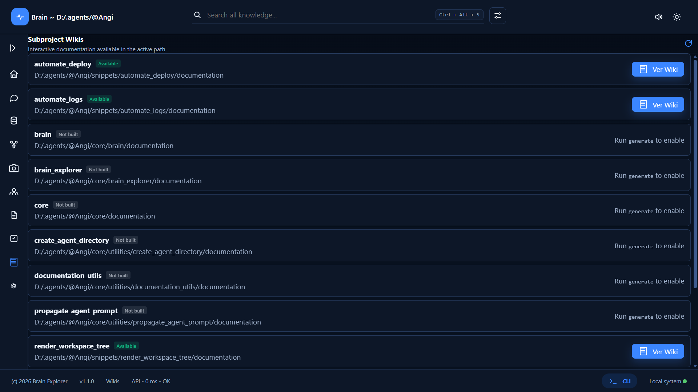

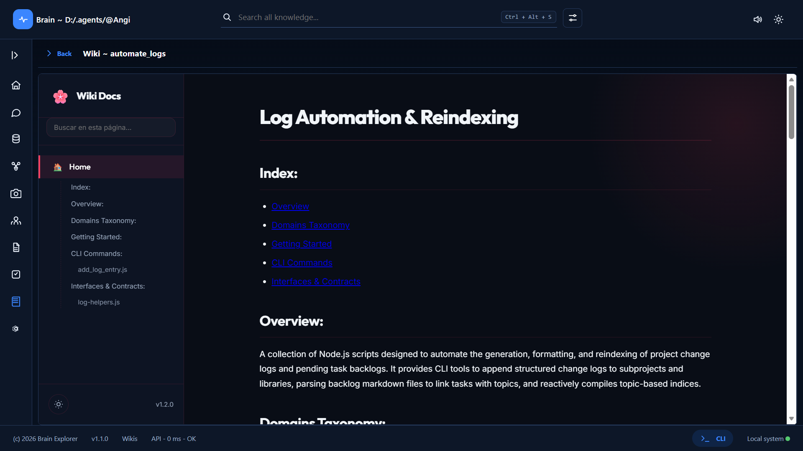

The documentation layout serves the core's Markdown knowledge as a live,
navigable reference within the same supervision environment.

**Features**

- browse documentation without generating a static site;
- render Markdown, Mermaid diagrams, and highlighted code;
- follow references across core subsystems;
- keep architectural guidance beside the runtime it describes.

### Runtime Settings

The settings layout centralizes runtime visibility and safe maintenance actions
for the active agent core.

**Features**

- inspect service health and configuration summaries;
- review registered workspace mirrors;
- refresh runtime status without leaving Explorer;
- invoke allowlisted maintenance actions through explicit endpoints.

## Foundational Idea

Digidog turns an agent into a durable software system rather than a loose
prompt plus scripts. The core owns the runtime and contracts; consumers own
workspace-local state. That separation lets the same agent supervise multiple
projects, preserve memory, inspect knowledge, and communicate through a visual
avatar without scattering behavior across unrelated folders.

The core provides:

- **An evolutionary knowledge schema** for memory, messages, logs, sources,
  vectors, entities, relations, deltas, and reviewable knowledge growth.
- **A Brain CLI** with JSON contracts for humans, tools, Explorer endpoints,
  automation, and local workspace consumers.
- **An interactive Explorer** for navigating memory, knowledge, logs, tasks,
  profiles, messages, settings, mirrors, and documentation.
- **An img2text picture pipeline** with model configuration, reusable guidance
  tags and character identities, editable descriptions, and graph projection.
- **A desktop avatar channel** for Markdown-rich speech, visual state,
  retained messages, audio replay, and direct supervision.
- **A cloneable agent foundation** that can seed new agents with code,
  defaults, empty stores, license, documentation, and safe ownership
  boundaries.

## Core Principles

- **Local-first ownership:** the framework runs from the user's machine and
  keeps private state local unless the user explicitly connects providers.
- **One core, many consumers:** each workspace uses a lightweight facade into
  the same agent core instead of copying runtime logic.
- **Explicit contracts:** configuration, stores, CLI commands, UI APIs, avatar
  states, and workspace mirrors are declared instead of inferred.
- **Supervised autonomy:** work is recorded through backlog entries,
  completion logs, message history, Explorer views, and JSON responses.
- **Composable identity:** a clone starts generic and empty; it does not inherit
  another agent's memories, messages, private stores, or personal data.

## Component Map

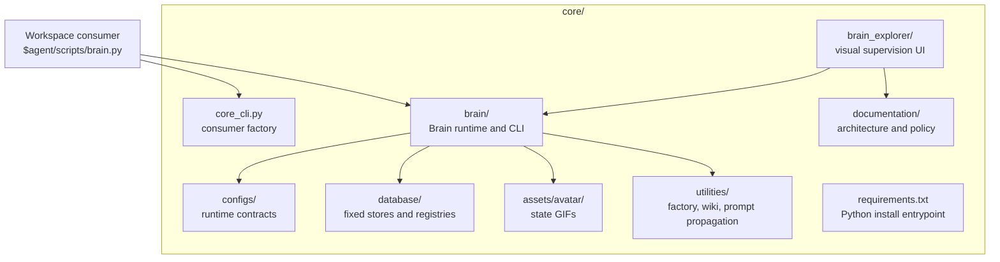

## Capabilities

| Area | What It Provides |
|---|---|
| Brain CLI | Command routing, JSON output, hidden no-speak mode, help contracts, and workspace-aware execution. |
| Memory | Structured domains, exact entry reads, updates, deletion, diary support, profiles, and semantic retrieval. |
| Knowledge | SQLite graph storage, sources, entities, relations, deltas, review flows, graph queries, and JSON-LD export. |
| Picture Intelligence | Configurable img2text analysis, semantic tag and character guidance, description editing, named-entity retention, and canonical picture-source graph projection. |
| Vector Search | Chroma-backed retrieval for memory, knowledge, logs, and workspace-local sources. |
| Messages | Durable avatar speaks with date, time, text, emotion, classification, chat/session grouping, audio references, and search integration. |
| Work Supervision | Backlog records, task states, completion logs, changelog indexing, and queryable work history. |
| Brain Explorer | Browser UI for core health, mirrors, memory, knowledge, logs, backlog, profiles, messages, settings, and docs. |
| Avatar | Desktop message window, GIF states, Markdown rendering, bounded images, voice synthesis, replay, and interaction controls. |
| Documentation | Live Markdown wiki serving, Mermaid, syntax highlighting, reference checks, and optional generation. |
| Agent Factory | New-agent creation, clone update, default configs, empty stores, license, README, avatar assets, and special domains. |
| Prompt Mirrors | Versionable registry and propagation utility for keeping instruction targets aligned. |
| Codex Harness | Local workspace configuration templates and rules for safer command and directory access. |

## Repository Layout

```text
agent-root/
|-- AGENT.md                         # Agent operating profile
|-- LICENSE                          # GNU AGPL v3, AGPL-3.0-only
|-- README.md                        # Verbatim copy of core/README.md
|-- core/                            # Nuclear runtime owned by one agent
|   |-- README.md                    # Single canonical product README source
|   |-- core_cli.py                  # Consumer factory entrypoint
|   |-- requirements.txt             # Canonical Python dependency entrypoint
|   |-- brain/                       # Brain runtime, CLI, services, tests
|   |-- brain_explorer/              # Explorer source and distribution
|   |-- configs/                     # Core-owned runtime contracts
|   |-- database/                    # Fixed stores and versionable registries
|   |-- assets/
|   |   |-- avatar/                  # Versioned avatar state GIFs
|   |   `-- screens/                 # Public README interface captures
|   |-- utilities/                   # Factory, wiki, prompt propagation
|   `-- documentation/               # Architecture and policies
|-- $agent/                          # Initial workspace consumer
|-- memory/                          # Authored memory domains
|-- snippets/                        # Reusable utilities
|-- skills/                          # Reusable instructions
|-- workflows/                       # Reusable processes
|-- pictures/                        # Private agent images
|-- $workspaces/                     # Private workspaces
|-- $user/                           # User-domain state
`-- .tmp/                            # Agent-local temporary artifacts
```

## Core Ownership Model

`core/` is global to one agent. It owns runtime code, configuration, fixed
global stores, UI assets, utilities, and documentation.

A workspace consumer is local to one workspace operating scope. Its
`$agent/scripts/brain.py` facade resolves this core, then delegates execution
to the Brain. Local logs, backlog, temporary files, and workspace-local stores
remain in the consumer.

This model keeps the boundary clear:

- global memory and configuration belong to the agent core;
- local work evidence belongs to the workspace consumer;
- generated stores and private data stay out of version control;
- core updates can move through clones without overwriting identity or state.

## Technology Stack

| Layer | Technology | Role |
|---|---|---|
| Runtime | Python 3 | Brain domains, CLI routing, services, persistence, migrations, utilities. |
| Contracts | Pydantic 2 | Runtime configuration and DTO validation. |
| Relational Stores | SQLite | Knowledge graph, sources, logs, backlog, messages, and projections. |
| Vector Stores | ChromaDB | Semantic retrieval across memory, knowledge, logs, and workspace data. |
| Explorer Frontend | TypeScript, Web Components, HTML, CSS | Framework-free browser supervision UI. |
| Explorer Backend | Python HTTP server | Static bundle serving and allowlisted Brain API bridge. |
| Avatar Window | PySide6 and Pillow | Desktop message rendering, GIF animation, and image processing. |
| Speech | Edge TTS and pyttsx3 | Network voice synthesis with local fallback. |
| Documentation | Node.js, Marked, Mermaid, Prism | Live Markdown wiki, diagrams, highlighting, and checks. |
| Tests | `unittest`, TypeScript compiler, Node test runner | Runtime, UI, utility, and contract validation. |

## Getting Started

Install Python dependencies from the agent root:

```powershell
py -m venv .venv
& '.\.venv\Scripts\Activate.ps1'
py -m pip install --upgrade pip
py -m pip install -r core/requirements.txt
```

For Explorer development:

```powershell
Push-Location core/brain_explorer
npm install
npm run verify
Pop-Location
```

The checked-in Explorer distribution can be served without rebuilding it.
Node.js is required for frontend development, verification, and documentation
utility work.

Create a workspace consumer:

```powershell
py core/core_cli.py create-brain <workspace-root> --json
```

Invoke Brain through the consumer facade:

```powershell
py '<workspace-root>/$agent/scripts/brain.py' wakeup --json
py '<workspace-root>/$agent/scripts/brain.py' help --json
```

Initialize the runtime and supervision channels:

```powershell
py '<workspace-root>/$agent/scripts/brain.py' wakeup --json
py '<workspace-root>/$agent/scripts/brain.py' start-avatar-service --json
py '<workspace-root>/$agent/scripts/brain.py' serve-explorer --port 8127
```

Explorer binds to loopback by default. Independent agent cores should use
different Explorer and avatar ports so their services never cross.

`core_cli.py` is a consumer factory. It is not the normal Brain entrypoint for
daily operation.

## Brain CLI

The Brain CLI is the core's primary contract surface. Every command supports
`--json` so tools and Explorer endpoints can consume deterministic output.

Common command groups include:

| Goal | Commands |
|---|---|
| Context | `wakeup`, `get-context` |
| Memory | `memory-structure`, `get-memory-entry`, `set-memory-entry`, `delete-memory-entry` |
| Search | `query`, `query-log`, `knowledge-query` |
| Knowledge | `knowledge-status`, `knowledge-show`, `knowledge-export`, `dream`, `knowledge-deltas` |
| Work | `add-task`, `show-backlog`, `set-task-status`, `complete-work` |
| Logs | `append-log`, `read-log`, `export-logs`, `update-log-index` |
| Messages | `avatar-message`, Explorer message sessions, audio replay, and downloads |
| Profiles | `list-profiles`, `read-profile` |
| Avatar | `start-avatar-service`, `stop-avatar-service`, `avatar-service-status` |
| Explorer | `serve-explorer` |
| Utilities | `wiki`, `propagate-agent-prompt`, `create-brain`, `register-project` |

Use built-in help for exact contracts:

```powershell
py '<workspace-root>/$agent/scripts/brain.py' help --json
```

## Brain Explorer

Brain Explorer is the visual supervision layer for the core. It serves a
static TypeScript bundle through the Brain and talks to allowlisted backend
routes that delegate to the same CLI contracts used by local tools.

Explorer includes:

- workspace mirror selection;
- memory tree navigation and entry editing;
- knowledge graph inspection with global/local source roots, exact domain
  scoping, hierarchical subregions, ranked viewport entities, reactive focus,
  animated fit restore, and deltas;
- canonical picture and message sources with preview cards and navigation to
  their dedicated Explorer views;
- global query with source filters;
- log and backlog review;
- profile browsing;
- retained message sessions by year, month, day, and chat;
- avatar audio replay and download;
- settings, health, and live documentation access.

Serve it from a consumer:

```powershell
py '<workspace-root>/$agent/scripts/brain.py' serve-explorer --port 8127
```

## Avatar Runtime

The avatar runtime gives the agent a communication channel beyond terminal
text. It can display Markdown messages, render bounded local or remote images,
play synthesized speech, retain message history, replay focused messages, and
switch visual GIF states.

Avatar state assets use this naming contract:

```text
core/assets/avatar/avatar_<state>.gif
```

The avatar service is core-bound. Independent agents should use different
loopback ports so their windows, speech queues, and retained messages remain
isolated.

Speech projection is sanitized independently from displayed Markdown: real
newlines and inline code remain narrable, while emoji grapheme sequences are
removed from synthesized text without changing the visible message.

## Utilities

### `create_agent_directory`

Creates a new agent directory from the current core. The clone receives source
code, default configuration, empty stores, versioned avatar assets, special
memory domains, license, README, and an initial consumer.

```powershell
py core/utilities/create_agent_directory/create_agent_directory.py create-agent `
  'D:\.agents' `
  --agent-name Nova `
  --user-name Alex `
  --json
```

It also provides `update-agent`, which refreshes another clone's `brain/`,
`brain_explorer/`, versioned `assets/screens/`, root README, and license without
overwriting private identity, configuration, stores, avatar assets, utilities,
memory, skills, snippets, workflows, or pictures.

```powershell
py core/utilities/create_agent_directory/create_agent_directory.py update-agent `
  'D:\.agents\@Nova' `
  --json
```

`core/README.md` is the only project README source. Creation and update copy it
verbatim to the agent repository root. The only identity-rendered factory
template is
`core/utilities/create_agent_directory/templates/AGENT.md`; it receives the
new agent and user names without inheriting another agent's personal context.

### `documentation_utils`

Serves Markdown documentation as a navigable live wiki with Mermaid diagrams,
syntax highlighting, reference checks, and optional logs integration. Static
generation remains available for explicit export use cases.

### `propagate_agent_prompt`

Copies the canonical agent prompt to configured instruction mirrors and
verifies hashes. The mirror registry lives under
`core/database/instruction_mirrors/` and is intended to be versionable.

## Configuration

`core/configs/brain_configs.json` owns the Brain runtime contract, including
`agent_name`, `user_name`, `agent_dir`, model stages, endpoints, and model
behavior. Its `pictures` section owns the img2text model, supported extensions,
and reusable guidance maps for semantic tags and named characters. Credentials
should be referenced through environment variables and must not be committed.

`core/configs/brain_avatar_config.json` owns avatar host, port, voice engine,
language voices, rate, pitch, volume, and theme defaults.

`core/configs/brain_mirrors.json` owns the workspace consumers visible to Explorer.
Selecting a mirror changes local workspace context; it does not change the
global agent identity or core stores.

Picture intelligence uses a strict Pydantic contract. A new agent receives a
disabled, provider-neutral mockup rather than a copy of live configuration:

```json
{
  "pictures": {
    "guidance": {
      "tags": {},
      "characters": {}
    },
    "image_model": {
      "model": "provider/vision-model",
      "base_url": "https://provider.example/v1",
      "api_key": "$VISION_API_KEY",
      "temperature": 0.1,
      "max_tokens": 1200,
      "enabled": false
    },
    "supported_extensions": [".png", ".jpg", ".jpeg", ".webp", ".gif", ".bmp"]
  }
}
```

The model endpoint must be OpenAI-compatible. Guidance maps provide
evidence-bound visual criteria for semantic tags and known characters; they do
not assert that a label appears in every image. See
[Picture intelligence and img2text](core/brain/documentation/brain-pictures-interfaces.md)
for the complete CLI, API, persistence, graph-projection, and security contract.

## Privacy and Version Control

Digidog is designed to keep live state private by default.

Do not commit:

- API keys or `.env` files;
- personal memory, private pictures, voice recordings, and user content;
- mutable SQLite databases and vector stores;
- generated caches, logs, test outputs, and transient files;
- generated static wiki output unless explicitly needed.

Versionable material includes source code, documentation, templates, tests,
avatar state GIFs, sound assets, and narrow registries that are meant to be
reviewed.

## Validation

Run the Brain test suite:

```powershell
python -m unittest discover -s core/brain/src/tests -v
```

Verify Brain Explorer:

```powershell
Push-Location core/brain_explorer
npm run verify
Pop-Location
```

Test the documentation utility:

```powershell
Push-Location core/utilities/documentation_utils
npm test
Pop-Location
```

Test clone creation and update isolation:

```powershell
python -m unittest discover `
  -s core/utilities/create_agent_directory/tests -v
```

## Documentation Map

- [Core contracts](core/documentation/README.md)
- [Architecture and ownership](core/documentation/architecture.md)
- [Documentation delivery policy](core/documentation/wiki-policy.md)
- [Brain subsystem](core/brain/documentation/README.md)
- [Brain CLI command reference](core/brain/documentation/brain-cli-commands.md)
- [Brain interfaces](core/brain/documentation/brain-interfaces.md)
- [Picture intelligence and img2text](core/brain/documentation/brain-pictures-interfaces.md)
- [Brain security](core/brain/documentation/brain-security.md)
- [Brain Explorer subsystem](core/brain_explorer/documentation/README.md)
- [Explorer frontend architecture](core/brain_explorer/documentation/frontend-architecture.md)
- [Explorer visual design](core/brain_explorer/documentation/frontend-visual-design.md)
- [Avatar asset contract](core/assets/avatar/README.md)
- [Agent directory factory](core/utilities/create_agent_directory/documentation/README.md)
- [Documentation utility](core/utilities/documentation_utils/documentation/README.md)
- [Prompt propagation utility](core/utilities/propagate_agent_prompt/documentation/README.md)

## Project Boundaries

Digidog provides local runtime infrastructure and explicit contracts. It
does not provide hosted model credentials, a cloud deployment, a pre-populated
personal memory, or guaranteed model-backed conclusions.

A new agent begins with default configuration, empty stores, and no inherited
identity. Knowledge growth depends on source quality, selected models,
credentials, provider availability, and review discipline.

## Author

Copyright (c) 2026 Yoel David

- Email: [`yoeldcd@gmail.com`](mailto:yoeldcd@gmail.com)
- X: [@SAY6267](https://x.com/SAY6267)

## License

Digidog is licensed under the
[GNU Affero General Public License v3.0 only](LICENSE)
([`AGPL-3.0-only`](https://spdx.org/licenses/AGPL-3.0-only.html)).

The AGPL is a strong copyleft license. If you modify Digidog and let users
interact with that modified version over a network, section 13 requires you to
offer those users the Corresponding Source at no charge. See the official GNU
AGPL v3 text for the controlling terms.
