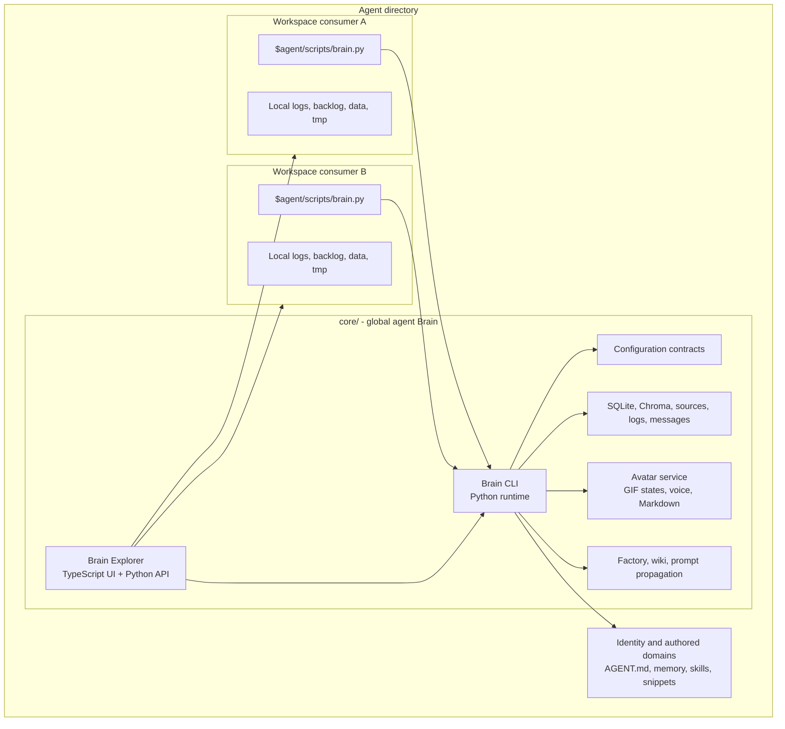

<!-- Author: Yoel David <yoeldcd@gmail.com> | X: https://x.com/SAY6267 -->

# Codedog


Codedog is a nuclear framework that provides an evolutionary knowledge schema
for agents and offers interactive channels for communication and supervision.

It treats an agent as a living software system: a durable core, explicit
contracts, structured memory, inspectable knowledge, workspace consumers, an
interactive Explorer, and an avatar channel that lets humans supervise the
agent as it works.

Codedog is not just a prompt folder. It is the operational foundation for
agents that need continuity, traceability, local ownership, and a way to grow
their knowledge without losing the boundary between identity, runtime,
workspace state, and private data.

## Foundational idea

Codedog exists to make agent continuity concrete.

An agent built with Codedog owns a single `core/`. That core is the agent's
nuclear runtime: it contains the Brain CLI, configuration contracts, stores,
Explorer server, avatar service, and reusable utilities. Workspaces consume
that core through lightweight local facades, so one agent can operate across
many projects without duplicating its identity or scattering its knowledge.

The framework is designed around four principles:

- **Evolutive knowledge:** memory, sources, logs, messages, and graph records
  become structured material that can be queried, reviewed, and improved.
- **Supervised autonomy:** every important operation is exposed through CLI
  contracts, JSON responses, logs, Explorer views, and avatar messages.
- **Local-first ownership:** source code, configuration, stores, and identity
  live on the user's machine unless the user explicitly connects providers.
- **Composable agency:** one core can create consumers, update clones, serve
  documentation, propagate prompts, and run beside other independent cores.

## What Codedog provides

| Domain | Capabilities |
|---|---|
| Brain CLI | A Python command layer for memory, knowledge, work logs, backlog, diary, profiles, queries, avatar control, and Explorer serving. |
| Evolutionary memory | Structured Markdown domains, special memory directories, diary entries, profiles, exact reads, updates, deletion, and search. |
| Knowledge graph | SQLite-backed sources, entities, relations, deltas, review flows, graph queries, and JSON-LD export. |
| Semantic retrieval | Chroma-backed vector stores for memory, knowledge, logs, and workspace-local retrieval. |
| Message memory | Durable spoken-message records with time, emotion, classification, session grouping, search integration, and audio references. |
| Work supervision | Backlog items, task states, completion records, changelog entries, and queryable work history. |
| Brain Explorer | A browser UI for navigating memory, knowledge, messages, profiles, logs, tasks, mirrors, settings, and documentation. |
| Avatar channel | A desktop message window with Markdown rendering, voice synthesis, image support, GIF states, retained messages, and replay controls. |
| Workspace mirrors | A core-owned registry that lets one Explorer supervise many consumers belonging to the same agent. |
| Core utilities | Agent directory creation, clone updating, live Markdown wiki serving, prompt propagation, and local Codex workspace templates. |

## Architecture at a glance



`core/` is global to one agent. A consumer is local to one workspace operating
scope. The consumer's `CORE_ROOT` resolves only the Brain code it imports; it
does not own core configuration, global databases, identity, or avatar state.

## Repository layout

```text
agent-root/
|-- AGENT.md                         # Agent operating profile
|-- LICENSE                          # GNU AGPL v3, AGPL-3.0-only
|-- README.md                        # This project introduction
|-- core/                            # Nuclear framework runtime for one agent
|   |-- core_cli.py                  # Consumer factory entrypoint
|   |-- requirements.txt             # Canonical Python dependency entrypoint
|   |-- brain/                       # Brain runtime, CLI, services, tests
|   |-- brain_explorer/              # Browser UI source and distribution
|   |-- configs/                     # Core-owned runtime contracts
|   |-- database/                    # Fixed stores and versionable registries
|   |-- assets/avatar/               # Versioned avatar state GIFs
|   |-- utilities/                   # Factory, wiki, prompt propagation
|   `-- documentation/               # Core architecture and contracts
|-- $agent/                          # Initial workspace consumer
|   |-- scripts/brain.py             # Relocatable facade into core/
|   |-- database/
|   |-- logs/
|   |-- data/
|   `-- .tmp/
|-- memory/                          # Authored memory domains
|   |-- profiles/
|   `-- diary/
|-- snippets/                        # Reusable utilities
|-- skills/                          # Reusable instructions
|-- workflows/                       # Reusable processes
|-- pictures/                        # Private images
|-- $workspaces/                     # Private workspaces
|-- $user/                           # User-domain state
`-- .tmp/                            # Agent-local temporary artifacts
```

## Core and consumer ownership

| Scope | Location | Responsibility |
|---|---|---|
| Core | `core/` | Runtime code, Explorer, avatar assets, utilities, global configs, fixed global stores, and registries. |
| Consumer | `<workspace>/$agent/` | Workspace-local facade, logs, backlog, local data, local stores, and temporary files. |
| Agent-authored domains | Repository root | Identity, memory, profiles, diary, snippets, skills, workflows, pictures, and private workspaces. |

This separation keeps clones updateable and keeps personal state out of the
framework code path. A clean clone receives default configuration and empty
stores; it does not inherit another agent's memories, user data, messages, or
private databases.

## Technology stack

| Layer | Technology | Purpose |
|---|---|---|
| Runtime | Python 3 | Brain domains, CLI routing, services, migrations, persistence, and utilities. |
| Contracts | Pydantic 2 | Typed configuration and DTO validation. |
| Relational storage | SQLite | Knowledge graph, sources, logs, backlog, messages, and durable projections. |
| Vector storage | ChromaDB | Semantic retrieval across memory, knowledge, logs, and workspace sources. |
| Explorer UI | TypeScript, Web Components, HTML, CSS | Framework-free visual supervision interface. |
| Explorer server | Python HTTP server | Static bundle serving and allowlisted Brain API bridge. |
| Avatar window | PySide6 and Pillow | Native desktop message UI, GIF states, Markdown, images, and interaction. |
| Speech | Edge TTS and pyttsx3 | Network voice synthesis with local fallback. |
| Documentation | Node.js, Marked, Mermaid, Prism | Live Markdown wiki serving, diagrams, highlighting, and validation. |
| Tests | `unittest`, TypeScript compiler, Node test runner | Runtime, utility, UI, and contract validation. |

## Installation

From the repository root:

```powershell
py -m venv .venv
& '.\.venv\Scripts\Activate.ps1'
py -m pip install --upgrade pip
py -m pip install -r core/requirements.txt
```

For Explorer development:

```powershell
Push-Location core/brain_explorer
npm install
npm run verify
Pop-Location
```

The checked-in Explorer distribution can be served without rebuilding it.
Node.js is required only for development, verification, and documentation
utility work.

## Configuration

`core/configs/brain_configs.json` is the core-owned Brain configuration. It
defines the agent name, user name, canonical agent directory, model stages,
provider endpoints, and model behavior. Fixed knowledge and vector database
locations are resolved by contract below `core/database/`; they are not
scattered through workspace consumers.

Credentials should be referenced through environment variables and should
never be committed:

```powershell
$env:OPENROUTER_API_KEY = '<secret>'
```

`core/configs/brain_avatar_config.json` owns avatar service settings: host,
port, voice engine, language voices, rate, pitch, volume, and theme defaults.
Each core can run on a distinct loopback port so independent agents do not
cross their avatar or Explorer services.

`core/configs/brain_mirrors.json` lists workspace consumers visible to Brain
Explorer. Selecting a mirror changes the local workspace context only; global
identity, global memory, and core services remain attached to the same core.

## First run

Use the workspace facade whenever possible:

```powershell
py '.\$agent\scripts\brain.py' wakeup --json
py '.\$agent\scripts\brain.py' show-backlog --json
py '.\$agent\scripts\brain.py' memory-structure --json
```

Start or inspect the avatar service:

```powershell
py '.\$agent\scripts\brain.py' start-avatar-service --json
py '.\$agent\scripts\brain.py' avatar-service-status --json
```

Serve Brain Explorer:

```powershell
py '.\$agent\scripts\brain.py' serve-explorer --port 8127
```

Then open `http://127.0.0.1:8127`. Use a different port for each agent core
that runs at the same time.

## CLI overview

Every command supports `--json`. The help command is the authoritative source
for current command contracts:

```powershell
py '.\$agent\scripts\brain.py' help --json
py '.\$agent\scripts\brain.py' help knowledge --json
```

Common command families:

| Goal | Commands |
|---|---|
| Rehydrate context | `wakeup`, `get-context` |
| Manage memory | `memory-structure`, `get-memory-entry`, `set-memory-entry`, `delete-memory-entry` |
| Search knowledge | `query`, `knowledge-query`, `knowledge-show`, `knowledge-export` |
| Evolve knowledge | `dream`, `knowledge-deltas`, `delete-knowledge-deltas` |
| Manage work | `add-task`, `show-backlog`, `set-task-status`, `complete-work` |
| Manage logs | `append-log`, `read-log`, `query-log`, `export-logs`, `update-log-index` |
| Manage messages | `avatar-message`, message search, Explorer message sessions, and audio replay |
| Manage profiles | `list-profiles`, `read-profile` |
| Serve UI | `serve-explorer`, `wiki` |
| Manage avatar | `start-avatar-service`, `stop-avatar-service`, `avatar-service-status` |
| Manage consumers | `create-brain`, `register-project` |
| Use utilities | `propagate-agent-prompt`, `wiki` |

Internal integrations can place the hidden global `--no-speak` flag before the
command to suppress voice while keeping the JSON contract:

```powershell
py '.\$agent\scripts\brain.py' --no-speak list-profiles --json
```

## Brain Explorer

Brain Explorer is the supervision surface for a Codedog core. It is served by
the Brain and delegates to allowlisted CLI-backed APIs rather than owning a
parallel data model.

Explorer provides views for:

- dashboard and core health;
- workspace mirror selection;
- memory domains and entries;
- global query and result provenance;
- knowledge graph records and deltas;
- logs, backlog, profiles, and messages;
- avatar message replay and audio download;
- settings and live subsystem documentation.

The Explorer can supervise all registered mirrors for the same agent from one
server. It does not merge independent agents; each core remains its own
ownership boundary.

## Avatar channel

The avatar channel gives an agent an interactive communication surface outside
plain terminal output. It combines a local HTTP daemon, a desktop message
window, Markdown rendering, image support, voice synthesis, retained messages,
replay controls, and versioned GIF states.

Avatar assets follow this contract:

```text
core/assets/avatar/avatar_<state>.gif
```

Examples include `avatar_awaiting.gif`, `avatar_working.gif`,
`avatar_happy.gif`, and `avatar_error.gif`. Unknown states fall back to the
configured default state. See
[`core/assets/avatar/README.md`](core/assets/avatar/README.md) for the avatar
state contract.

## Core utilities

### `create_agent_directory`

Creates a complete new agent directory from the current core. The generated
agent receives code, default configuration, empty stores, avatar assets,
special memory domains, this README, and the AGPL license.

```powershell
py core/utilities/create_agent_directory/create_agent_directory.py create-agent `
  'D:\.agents' `
  --agent-name Nova `
  --user-name Alex `
  --json
```

The utility also provides `update-agent`, which refreshes another clone's
`core/brain`, `core/brain_explorer`, root `README.md`, and root `LICENSE`
without overwriting identity, configs, databases, assets, utilities, memory,
skills, snippets, workflows, or pictures.

### `wiki`

Serves Markdown documentation as a live navigable wiki with Mermaid diagrams,
syntax highlighting, reference checks, and optional log views. Static
generation remains available for explicit export scenarios, but the live
server is the normal documentation channel.

### `propagate-agent-prompt`

Copies the canonical agent prompt to configured instruction mirrors and
verifies content hashes. The mirror registry is versionable and lives under
`core/database/instruction_mirrors/`.

## Creating workspace consumers

Create another consumer for the same core:

```powershell
py core/core_cli.py create-brain '<workspace-root>' --json
```

The resulting `<workspace-root>/$agent/scripts/brain.py` imports this core
through a relative path. The workspace owns its local data; the core owns its
runtime and global configuration.

## Privacy and version control

Codedog is designed to keep live state private by default.

Do not commit:

- API keys or `.env` files;
- personal memory, private pictures, voice recordings, and user content;
- mutable SQLite databases and vector stores;
- generated caches, logs, test outputs, and transient files;
- generated static wiki output unless explicitly needed.

Versionable material includes source code, documentation, configuration
templates, avatar state GIFs, utility contracts, tests, and narrow registries
that are meant to be reviewed.

## Development and validation

Run the Brain test suite:

```powershell
python -m unittest discover -s core/brain/src/tests -v
```

Verify Brain Explorer:

```powershell
Push-Location core/brain_explorer
npm run verify
Pop-Location
```

Test the documentation utility:

```powershell
Push-Location core/utilities/documentation_utils
npm test
Pop-Location
```

Test clone creation and update isolation:

```powershell
python -m unittest discover `
  -s core/utilities/create_agent_directory/tests -v
```

## Documentation map

- [Core mental model and contracts](core/documentation/README.md)
- [Architecture and ownership boundaries](core/documentation/architecture.md)
- [Documentation delivery policy](core/documentation/wiki-policy.md)
- [Brain subsystem](core/brain/documentation/README.md)
- [Brain CLI command reference](core/brain/documentation/brain-cli-commands.md)
- [Brain interfaces](core/brain/documentation/brain-interfaces.md)
- [Brain security](core/brain/documentation/brain-security.md)
- [Brain Explorer subsystem](core/brain_explorer/documentation/README.md)
- [Explorer frontend architecture](core/brain_explorer/documentation/frontend-architecture.md)
- [Explorer visual design](core/brain_explorer/documentation/frontend-visual-design.md)
- [Agent directory factory](core/utilities/create_agent_directory/documentation/README.md)
- [Documentation utility](core/utilities/documentation_utils/documentation/README.md)
- [Prompt propagation utility](core/utilities/propagate_agent_prompt/documentation/README.md)

## Project boundaries

Codedog provides local runtime infrastructure and explicit contracts. It does
not provide hosted model credentials, a cloud deployment, a pre-populated
personal memory, or guaranteed model-backed conclusions.

A newly created agent starts with generic instructions, default provider
references, empty stores, and no inherited identity. Knowledge extraction and
semantic retrieval depend on the quality of configured sources, selected
models, credentials, and provider availability.

## Author

Copyright (c) 2026 Yoel David

- Email: [`yoeldcd@gmail.com`](mailto:yoeldcd@gmail.com)
- X: [@SAY6267](https://x.com/SAY6267)

## License

Codedog is licensed under the
[GNU Affero General Public License v3.0 only](LICENSE)
([`AGPL-3.0-only`](https://spdx.org/licenses/AGPL-3.0-only.html)).

The AGPL is a strong copyleft license. If you modify Codedog and let users
interact with that modified version over a network, section 13 requires you to
offer those users the Corresponding Source at no charge. See the
[official GNU AGPL v3 text](https://www.gnu.org/licenses/agpl-3.0.html) for the
controlling terms.
