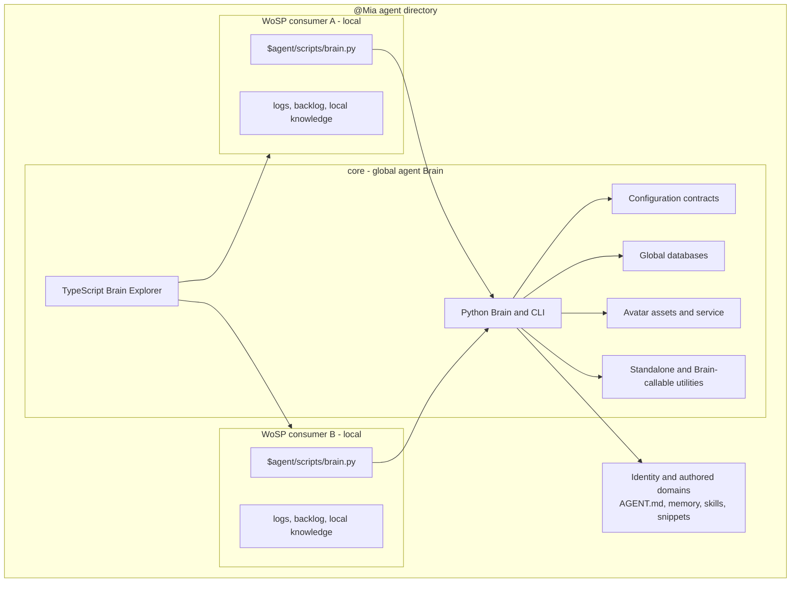

<!-- Author: Yoel David <yoeldcd@gmail.com> | X: https://x.com/SAY6267 -->

# Codex Dog - @Mia


Codex Dog is a local-first framework for building persistent, visual software
agents. This repository is the complete directory of `@Mia`: an
independent agent with one global Brain core, one animated avatar runtime, one
browser-based Explorer, and any number of workspace-local consumers.

The project turns an agent into a durable software system rather than a loose
collection of prompts. Identity, configuration, memory contracts, knowledge,
tools, services, and workspace boundaries are explicit, testable, and
versionable.

## Why Codex Dog exists

Most agent setups mix global identity, project context, runtime code, secrets,
and generated state in one directory. Codex Dog separates those concerns so an
agent can:

- keep one stable identity and global memory across many workspaces;
- expose a small, consistent CLI to every local consumer;
- inspect and manage all registered workspace mirrors from one Explorer;
- maintain private SQLite and vector stores without committing live data;
- run its avatar and Explorer independently from other cloned agents;
- clone a clean agent seed without copying another agent's memories;
- receive controlled runtime updates without overwriting local identity or
  databases.

## Core model

One Codex Dog repository belongs to one agent. Its `core/` is global for that
agent. A consumer is local to one workspace operating scope (WoSP) and contains
only a relocatable Brain launcher plus workspace-owned data.



`CORE_ROOT` in a consumer resolves only the Brain code it imports. Global
agent-owned paths come from the core containing that Brain and from the
canonical `agent_dir` in `core/configs/brain_configs.json`. Consumers do not
own or override core configuration.

## What it can do

| Domain | Capabilities |
|---|---|
| Memory | Structured Markdown domains, indexed retrieval, exact entry reads, updates, and deletion. |
| Knowledge | SQLite knowledge graph, source ingestion, entity and relation extraction, reviewable deltas, graph queries, and JSON-LD export. |
| Semantic search | Global and workspace-local Chroma vectorstores with source-aware results. |
| Work management | Durable local backlog with priorities, status transitions, guarded deletion, and completion records. |
| Logs and diary | Database-backed work logs, exact date/time readers, filtered exports, personal diary entries, and migration from legacy Markdown. |
| Profiles | Versionable behavior and specialization profiles discoverable through the Brain CLI and Explorer. |
| Workspace mirrors | One core-owned registry of local consumers that Explorer can switch between without swapping agent identity. |
| Brain Explorer | Visual access to memory, profiles, queries, knowledge, logs, backlog, settings, messages, and served documentation. |
| Avatar | Animated state GIFs, a PySide6 message window, Markdown rendering, voice synthesis, retained messages, and per-core service isolation. |
| Utilities | Live Markdown wiki server/generator, canonical prompt propagation, consumer creation, and clean agent cloning/updating. |
| Structured automation | JSON output contracts for CLI consumers and a hidden no-speak mode for internal integrations. |

## Technology stack

| Layer | Technology | Role |
|---|---|---|
| Runtime | Python 3 | Brain domains, CLI routing, services, persistence, migration, and utilities. |
| Data contracts | Pydantic 2 | Typed runtime configuration and domain DTO validation. |
| Relational storage | SQLite | Knowledge graph, sources, logs, backlog, and other durable projections. |
| Vector storage | ChromaDB | Semantic memory, knowledge, and workspace-local retrieval. |
| Desktop avatar | PySide6 and Pillow | Native windowing, animation, Markdown presentation, and image processing. |
| Speech | Edge TTS and pyttsx3 | Network voice synthesis with a configurable local fallback. |
| Model transport | Requests with an OpenAI-compatible endpoint | Configurable text, extraction, and embedding model calls. |
| Explorer frontend | TypeScript 5.7, Web Components, HTML, and CSS | Framework-free browser UI compiled to a static bundle. |
| Explorer backend | Python HTTP server | Core-bound API and static asset server using the Brain CLI as its source of truth. |
| Documentation utility | Modern JavaScript and Node.js | Live Markdown wiki serving, reference checks, logs view, and optional generation. |
| Documentation assets | Marked, Mermaid, Prism, and svg-pan-zoom | Markdown, diagrams, highlighting, and interactive SVG support. |
| Testing | `unittest`, Node test runner, and TypeScript compiler | Runtime, utility, UI contract, and type validation. |

The default model configuration uses an OpenRouter-compatible API, but model
names, endpoints, credentials, temperature, and token limits are declarative.
Credentials are referenced through environment variables and should never be
committed.

## Repository layout

```text
@Mia/
|-- AGENT.md                         # Agent identity and operating methodology
|-- LICENSE                          # GNU AGPL v3, AGPL-3.0-only
|-- README.md                        # This project guide
|-- core/                            # Global Brain owned by this agent
|   |-- core_cli.py                  # Creates consumers for this same core
|   |-- requirements.txt             # Canonical Python installation entrypoint
|   |-- brain/                       # Python runtime and CLI
|   |-- brain_explorer/              # TypeScript source, build, and static dist
|   |-- configs/                     # Versioned global configuration
|   |-- database/                    # Fixed private stores and public registries
|   |-- assets/avatar/               # Versioned avatar_<state>.gif assets
|   |-- utilities/                   # Factory, wiki, and prompt propagation
|   `-- documentation/               # Cross-subsystem contracts and architecture
|-- $agent/                          # Initial co-located local consumer
|   |-- scripts/brain.py             # Relocatable CLI facade
|   |-- database/                    # Local stores
|   |-- logs/
|   |-- data/
|   `-- .tmp/
|-- memory/                          # Agent-authored global memory
|   |-- profiles/
|   `-- diary/
|-- snippets/                        # Reusable agent-authored utilities
|-- skills/                          # Reusable domain instructions
|-- workflows/                       # Reusable processes
|-- pictures/                        # Private personal images
|-- $workspaces/                     # Private workspaces
|-- $user/                           # User-domain state
`-- .tmp/                            # Agent-local temporary artifacts
```

## Global and local data ownership

| Scope | Location | Examples |
|---|---|---|
| Global core | `core/configs/`, `core/database/` | Model configuration, mirror registry, knowledge, shared sources, vectorstores, avatar state. |
| Local consumer | `<workspace>/$agent/` | Logs, backlog, local sources, local knowledge, local vectors, temporary data. |
| Agent-authored | Repository root domains | `AGENT.md`, memory, profiles, diary, snippets, skills, workflows, and pictures. |

Mutable database content is private by default. Declarative configuration,
documentation, source code, avatar state GIFs, and operational registries can
be versioned. In particular,
`core/database/instruction_mirrors/agent_prompt_mirrors.txt` is a versionable
registry, not a runtime database.

## Requirements

- Python 3 with the Windows `py` launcher, or an equivalent Python command.
- Node.js and npm for Explorer development and documentation utility tests.
- A desktop session for the PySide6 avatar window.
- Network access for Edge TTS and configured remote model providers.
- An API credential such as `OPENROUTER_API_KEY` for model-backed operations.

The commands below target PowerShell. The Brain and Node components are largely
portable, while service lifecycle behavior and desktop integration have been
designed and tested primarily on Windows.

## Installation

From the repository root:

```powershell
py -m venv .venv
& '.\.venv\Scripts\Activate.ps1'
py -m pip install --upgrade pip
py -m pip install -r core/requirements.txt
```

For Explorer development:

```powershell
Push-Location core/brain_explorer
npm install
npm run verify
Pop-Location
```

The repository includes a built Explorer bundle in
`core/brain_explorer/dist/`; Node.js is not required merely to serve that
checked-in bundle.

## Configuration

### Brain

Edit `core/configs/brain_configs.json` to configure model stages and the
canonical `agent_dir`. Fixed knowledge and vectorstore database locations are
resolved by contract below `core/database/` and are deliberately absent from
configuration.

The default model stages are:

- entity detection;
- relation extraction;
- schema evolution;
- deduplication;
- consolidation;
- profile synthesis;
- text generation and embeddings for memory retrieval.

Set credentials through the environment, for example:

```powershell
$env:OPENROUTER_API_KEY = '<secret>'
```

### Avatar

`core/configs/brain_avatar_config.json` owns the avatar daemon host, port,
voice engine, language voices, rate, pitch, and volume. Every cloned agent is
assigned a stable high loopback port so separate cores do not accept each
other's daemon.

### Mirrors

`core/configs/brain_mirrors.json` lists consumers visible to this agent's
Explorer. Selecting a mirror changes only the local workspace context; global
memory, configuration, services, and identity remain attached to this core.

## First run

All normal operations go through a consumer facade:

```powershell
py '.\$agent\scripts\brain.py' wakeup --json
py '.\$agent\scripts\brain.py' show-backlog --json
py '.\$agent\scripts\brain.py' memory-structure --json
```

Start the avatar service:

```powershell
py '.\$agent\scripts\brain.py' start-avatar-service --json
py '.\$agent\scripts\brain.py' avatar-service-status --json
```

Serve Brain Explorer in the foreground:

```powershell
py '.\$agent\scripts\brain.py' serve-explorer --port 8127
```

Open `http://127.0.0.1:8127`. Use a different port for every simultaneously
running agent core. `serve-explorer --json` reports configuration without
starting a blocking foreground server.

## CLI overview

Every command supports `--json`. Run the built-in help for the authoritative
command list and parameter contracts:

```powershell
py '.\$agent\scripts\brain.py' help --json
py '.\$agent\scripts\brain.py' help knowledge --json
```

Common commands include:

| Goal | Command |
|---|---|
| Rehydrate the agent | `wakeup`, `get-context` |
| Inspect or edit memory | `memory-structure`, `get-memory-entry`, `set-memory-entry`, `delete-memory-entry` |
| Search across sources | `query` |
| Manage diary entries | `write-diary`, `read-diary`, `edit-diary` |
| Manage work | `add-task`, `show-backlog`, `set-task-status`, `complete-work` |
| Manage logs | `append-log`, `read-log`, `query-log`, `export-logs`, `update-log-index` |
| Inspect knowledge | `knowledge-status`, `knowledge-query`, `knowledge-show`, `knowledge-export` |
| Run knowledge synthesis | `dream`, `knowledge-deltas`, `delete-knowledge-deltas` |
| Manage vectorstores | `update-vectorstore`, `rebuild-vectorstore`, `vectorstore-status` |
| Manage profiles | `list-profiles`, `read-profile` |
| Manage avatar runtime | `avatar-message`, `start-avatar-service`, `stop-avatar-service`, `avatar-service-status` |
| Serve the visual UI | `serve-explorer` |
| Serve documentation | `wiki` |
| Synchronize prompt mirrors | `propagate-agent-prompt` |
| Add another consumer | `create-brain`, `register-project` |

Internal integrations may place the hidden global `--no-speak` flag before the
command to suppress voice while retaining the JSON contract:

```powershell
py '.\$agent\scripts\brain.py' --no-speak list-profiles --json
```

## Brain Explorer

Brain Explorer is a framework-free TypeScript application served by the Python
Brain. It does not bypass the CLI or own a second data model. Its API delegates
to allowlisted Brain commands and validates the selected workspace against the
core mirror registry.

The UI provides dedicated views for:

- dashboard and core health;
- memory structure and entries;
- global query and result provenance;
- knowledge graph records and deltas;
- logs, backlog, profiles, and messages;
- settings and mirror selection;
- live subsystem documentation.

Each Explorer process resolves its own physical core, static bundle, agent
directory, configuration, and stores. Multiple agents can therefore run side
by side on distinct ports.

## Avatar runtime

The avatar channel combines an HTTP daemon, a native PySide6 window, Markdown
presentation, speech synthesis, and versioned animation states. Assets follow
this contract:

```text
core/assets/avatar/avatar_<state>.gif
```

Examples include `avatar_awaiting.gif`, `avatar_working.gif`,
`avatar_happy.gif`, and `avatar_error.gif`. Unknown states fall back to the
configured/default state. See
[`core/assets/avatar/README.md`](core/assets/avatar/README.md) for the complete
naming, fallback, transparency, and seed policy.

## Core utilities

### Documentation Utils

The `wiki` utility serves Markdown documentation with navigation, Mermaid,
syntax highlighting, link/reference validation, and an optional logs view. The
server is the normal delivery mechanism; static generation remains available
for explicit export use cases.

Documentation:
[`core/utilities/documentation_utils/documentation/README.md`](core/utilities/documentation_utils/documentation/README.md)

### Agent prompt propagator

`propagate-agent-prompt` copies the canonical agent prompt to the destinations
listed in the versioned instruction mirror registry and verifies content
hashes. This keeps tool-specific instruction files aligned without embedding
absolute paths in Brain.

Documentation:
[`core/utilities/propagate_agent_prompt/documentation/README.md`](core/utilities/propagate_agent_prompt/documentation/README.md)

### Agent directory factory

`create_agent_directory` is intentionally standalone: an existing Brain may
operate an agent, but it must not silently create a new identity boundary.

Create a clean agent with default configuration, empty stores, avatar assets,
special memory domains, this full README, and the AGPL license:

```powershell
py core/utilities/create_agent_directory/create_agent_directory.py create-agent `
  'D:\.agents' `
  --agent-name Nova `
  --user-name Alex `
  --json
```

Documentation:
[`core/utilities/create_agent_directory/documentation/README.md`](core/utilities/create_agent_directory/documentation/README.md)

## Consumers and workspaces

Create another consumer for this same agent core:

```powershell
py core/core_cli.py create-brain '<workspace-root>' --json
```

The resulting `<workspace-root>/$agent/scripts/brain.py` imports this core
through a relative path. Local databases remain under that workspace; global
configuration and stores remain here.

## Updating an existing clone

Run `update-agent` from the canonical source agent's utility and point it at a
different target agent:

```powershell
py '<canonical-agent>\core\utilities\create_agent_directory\create_agent_directory.py' `
  update-agent '<target-agent>' --json
```

The update is content-aware and idempotent. It synchronizes:

- `core/brain/`;
- `core/brain_explorer/`;
- root `README.md`;
- root `LICENSE`.

It deliberately preserves:

- `AGENT.md` and identity;
- `core/configs/`;
- `core/database/`;
- `core/assets/`;
- `core/utilities/`;
- memory, diary, profiles, snippets, skills, workflows, and pictures;
- consumer-local state.

Changed files are replaced atomically, removed upstream code is removed from
the synchronized code roots, transient caches are excluded, and a second run
with the same source performs zero copies.

## Privacy and version control

The default `.gitignore` keeps live agent state private:

- mutable memory, pictures, and workspaces;
- SQLite databases and vectorstores;
- generated logs and avatar runtime storage;
- Python, Node, test, and type-check caches;
- generated wiki output.

Projects may explicitly re-include a curated profile or other declarative
artifact, but should keep the exception narrow. Never commit API keys, personal
memory, voice recordings, generated databases, or user content without an
intentional review.

## Development and validation

Run the Brain suite:

```powershell
python -m unittest discover -s core/brain/src/tests -v
```

Verify Brain Explorer types, visual contracts, and the generated bundle:

```powershell
Push-Location core/brain_explorer
npm run verify
Pop-Location
```

Test the documentation utility:

```powershell
Push-Location core/utilities/documentation_utils
npm test
Pop-Location
```

Test clone creation and update isolation:

```powershell
python -m unittest discover `
  -s core/utilities/create_agent_directory/tests -v
```

## Documentation map

- [Core mental model and contracts](core/documentation/README.md)
- [Architecture and ownership boundaries](core/documentation/architecture.md)
- [Documentation delivery policy](core/documentation/wiki-policy.md)
- [Brain subsystem](core/brain/documentation/README.md)
- [Brain CLI command reference](core/brain/documentation/brain-cli-commands.md)
- [Brain interfaces](core/brain/documentation/brain-interfaces.md)
- [Brain security](core/brain/documentation/brain-security.md)
- [Brain Explorer subsystem](core/brain_explorer/documentation/README.md)
- [Explorer frontend architecture](core/brain_explorer/documentation/frontend-architecture.md)
- [Explorer visual design](core/brain_explorer/documentation/frontend-visual-design.md)

## Project boundaries

Codex Dog provides local runtime infrastructure and explicit contracts; it does
not provide hosted model credentials, a cloud deployment, or a pre-populated
personal memory. A newly created agent starts with generic instructions,
default provider references, empty private stores, and no inherited identity.

Model-backed results still depend on provider availability, selected models,
credentials, and source quality. The knowledge delta workflow exists so
extracted facts can be inspected before they become durable graph state.

## Author

Copyright (c) 2026 Yoel David

- Email: [`yoeldcd@gmail.com`](mailto:yoeldcd@gmail.com)
- X: [@SAY6267](https://x.com/SAY6267)

## License

Codex Dog is licensed under the
[GNU Affero General Public License v3.0 only](LICENSE)
([`AGPL-3.0-only`](https://spdx.org/licenses/AGPL-3.0-only.html)).

The AGPL is a strong copyleft license. If you modify Codex Dog and let users
interact with that modified version over a network, section 13 requires you to
offer those users the Corresponding Source at no charge. See the
[official GNU AGPL v3 text](https://www.gnu.org/licenses/agpl-3.0.html) for the
controlling terms.
