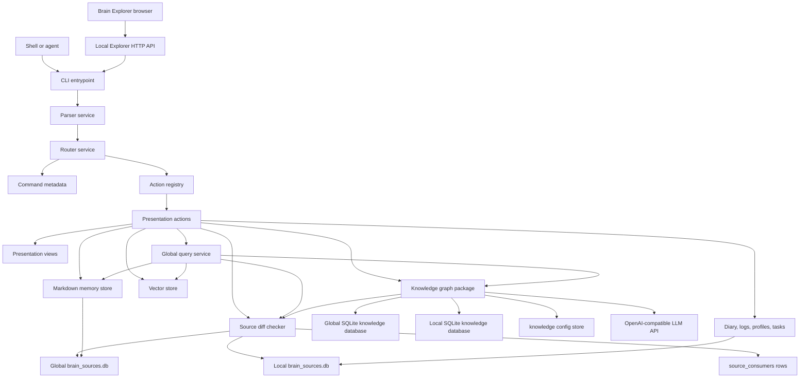

# Brain Architecture

## Index:
- [Overview](#overview)
- [Component Diagram](#component-diagram)
- [Infrastructure & Decisions](#infrastructure--decisions)

## Overview:
The Brain architecture separates command parsing, command action orchestration, rendering, domain services,
persistence, and cognitive processing. Command modules declare user-facing argument contracts only. Presentation
actions execute parsed commands, and presentation views render terminal output. Service modules coordinate business behavior.
Repository and store modules own durable state. This split keeps command actions small enough to test and prevents
LLM prompts, SQL migrations, or filesystem policies from leaking into terminal presentation code.

The system has three durable knowledge surfaces. Markdown memory remains the editable human source of truth. The
global knowledge graph stores source identity, source-anchored entity labels, relation types, ID-to-ID persisted
relations, schema suggestions, and consolidation audit records derived from shared memory, diary, and profiles.
The local knowledge graph stores the same graph model for repository-local material such as workspace logs.
Query orchestration can read memory, the global graph, and the local graph, then return a single normalized result
shape to callers.

Source freshness is a separate layer. The shared `brain.infrastructure.sources.diff_checker` module refreshes scoped SQLite
source registries from filesystem mtimes before query or dream work. `core/database/sources/brain_sources.db` catalogs
global Markdown memory. `$agent/database/brain_sources.db` catalogs local workspace logs. Each heavier consumer,
such as the knowledge graph, keeps processed mtimes in `source_consumers` rows. Knowledge SQLite stores graph
identity and relations; source registry SQLite stores file freshness and lightweight stats.

## Component Diagram:

## Infrastructure & Decisions:

## `brain.cli`

### Infrastructure:
`brain.cli` is a thin process entrypoint. It configures the console and delegates runtime execution to
`brain.presentation.router.services.cli_runtime_service`. Parser construction lives in
`brain.presentation.parser.services.argument_parser_service`, global presentation flags live in
`brain.presentation.parser.services.global_flags_service`, and command dispatch lives in
`brain.presentation.router.services.command_router_service`.

#### Components
The runtime service depends on declarative command modules from `brain.presentation.commands.registry` and
executable handlers from `brain.presentation.actions.registry`. It does not directly modify memory files, SQLite
rows, vector collections, or knowledge graph records.

#### Services
The router service boundary is dispatch. Each action receives parsed arguments and returns an integer process
code. Domain behavior stays in stores, query services, knowledge services, or application helpers.

#### Databases
The CLI router has no direct database dependency. Database writes occur through the memory store, vectorstore,
or knowledge repository invoked by actions.

#### External Dependencies
The parser uses Python standard library argument parsing. The entrypoint performs optional Windows console
configuration. Neither layer calls external APIs.

## `brain.infrastructure.explorer`

### Infrastructure:
`brain.infrastructure.explorer` serves the static Brain Explorer bundle and provides a local JSON API. API routes
do not access memory, logs, or knowledge repositories directly. They validate request parameters, build fixed
allowlisted `brain.py` argv vectors, and execute them in-process through
`BrainCliFacade`. One Explorer server belongs to one agent core and manages all
of that agent's registered consumers.

#### Components
`BrainExplorerRequestHandler` owns HTTP routing, static file serving,
request-size limits, registered-mirror validation, and JSON response envelopes.
`BrainCliFacade` owns serialized in-process execution, temporary local workspace
context, stdout/stderr capture, and JSON parsing.

#### Services
The explorer server is a presentation adapter. It delegates durable work to existing CLI commands such as
`memory-structure`, `get-memory-entry`, `set-memory-entry`, `knowledge-status`, `knowledge-query`, `list-profiles`,
and `export-logs`.

The browser selects a consumer with `X-Workspace-Root`. The server accepts that
header only when the resolved path exists in the core-owned
`brain_mirrors.json`. Selection changes local databases and workspace resources;
core databases, config, agent memory, assets, and utilities remain global.

#### Databases
The explorer server has no direct database dependency. Database access remains inside the existing CLI command
actions and their application services.

#### External Dependencies
The server uses only the Python standard library. The frontend bundle is static and dependency-free at runtime.

### Key Decisions:

#### Context
The workspace has many commands across memory, logs, tasks, vector stores, profiles, snippets, and knowledge.
Static parser wiring would make help text and implementation drift quickly.

#### Alternatives Considered
A single monolithic parser function would centralize parsing but bury command contracts in one file. Separate
standalone scripts would reduce coupling but make shared flags, help formatting, and test discovery inconsistent.

#### Chosen Solution.
Each command module owns schema metadata only. Actions own execution. The parser and router remain generic
assembly and dispatch services.

## `brain.presentation.commands`

### Infrastructure:
Command modules declare CLI input contracts. They are grouped by domain:
general commands, memory commands, diary commands, log commands, profile commands, snippet commands, vectorstore
commands, task backlog commands, and knowledge commands.

#### Components
Each module exposes a `SCHEMA` value. The schema declares the command name, domain, help text, arguments,
defaults, and flags. Modules under `brain.presentation.commands` do not expose `handle()` functions.

#### Services
Actions are adapters, not service owners. For example, the global query action delegates retrieval to the global
query service, then delegates human terminal rendering to `brain.presentation.views.query`. Knowledge lifecycle
actions delegate schema, source discovery, dream, query, and export behavior to the knowledge package.

#### Databases
Command metadata modules do not touch databases. Presentation actions touch databases only through domain APIs.
Knowledge actions use the knowledge repository. Vectorstore actions use the vectorstore manager. Log and memory
actions use filesystem store helpers and index rebuilders.

#### External Dependencies
Command metadata modules do not call external services. The dream action delegates configured model-backed stages
to the dream runner and handles review, confirmation, and presentation.

### Key Decisions:

#### Context
The command layer must stay readable while supporting many operational workflows.

#### Alternatives Considered
Embedding persistence logic directly in command metadata files would be faster for one-off features, but would
make tests and schema evolution fragile.

#### Chosen Solution.
Command files remain declarative schemas. Action files remain adapters around typed DTOs, stores, repositories,
views, and services.

## `brain.application.querying`

### Infrastructure:
The global query path coordinates memory and knowledge retrieval. It accepts source, mechanism, and knowledge
scope selectors so callers can choose all backends, only memory, only knowledge graph index search, only vector
search, only direct Markdown text matching, or a specific graph database scope.

#### Components
The main component is the global query service. It produces normalized result DTOs with source, mechanism, kind,
rank, title, text, data, and warning fields.

#### Services
The service calls the knowledge query backend for graph-indexed entity and evidence search across selected graph
scopes, the vectorstore manager for embedding-backed memory search, and direct Markdown scanning for deterministic
text matches. Before these reads, it refreshes lightweight source registries and checks selected knowledge graph
consumer state. If source mtimes are newer than the graph consumer state, query still returns graph matches but
adds a warning result indicating that a dream pass is needed.

#### Databases
The query path reads selected private knowledge databases through the repository. Vector search reads the
configured ChromaDB collection. Direct text search reads Markdown memory files without writing them.

#### External Dependencies
Vector search depends on embedding availability. If embeddings are unavailable, the query service returns a
warning result and still allows compatible deterministic backends to answer.

### Key Decisions:

#### Context
The previous command surface had separate search concepts, which made callers choose storage details before
asking a question.

#### Alternatives Considered
Keeping a direct search command beside graph query would preserve old habits but continue splitting lookup across
multiple command names.

#### Chosen Solution.
The global query command is the single consultation point. Source and mechanism flags select the retrieval path.

## `brain.infrastructure.sources.diff_checker`

### Infrastructure:
The source diff checker is the shared freshness layer for every brain knowledge consumer. It scans source trees
with cheap filesystem mtimes, writes lightweight rows into scoped `brain_sources.db` registries, and compares
those rows against per-consumer processed mtimes before expensive retrieval, embedding, or graph-building work
runs.

#### Components
The module owns registry refresh helpers, flat source-record DTOs, consumer diff checks, and processed-source
state writers. The current source catalogs are `core/database/sources/brain_sources.db` for global Markdown memory and
`$agent/database/brain_sources.db` for workspace-local logs. The same registry stores source path, source type,
title, mtime, size label, line count label, entry count, active state, and per-consumer processed state.

#### Services
Query uses the diff checker as a fast staleness pass before reading graph databases. Dream uses it to select only
sources whose mtime changed for the knowledge graph consumer. Log indexing also refreshes the local source
registry so local knowledge can detect changed logs without reparsing every log file during every query.

#### Databases
The diff checker owns source-registry SQLite writes. Graph source identity rows are still created later by the
knowledge repository when a real delta needs an anchor. This keeps freshness state reusable across consumers while
keeping graph tables focused on semantic objects and edges.

#### External Dependencies
The module uses only Python standard library filesystem and SQLite APIs.

### Key Decisions:

#### Context
Memory, logs, vector search, and the knowledge graph all need to know whether source files changed before doing
heavier work. Putting that update state in the KG database would couple unrelated consumers to the graph schema,
but keeping it in JSON creates a second stale persistence contract.

#### Alternatives Considered
Each consumer could maintain its own ad hoc mtime scan. That would repeat logic, drift over time, and make query
and dream disagree about what is stale.

#### Chosen Solution.
Source freshness is a shared source-registry contract. `sources` rows describe current files; `source_consumers`
rows describe what one subsystem has already processed.

## `brain.application.knowledge`

### Infrastructure:
The knowledge package implements the cognitive graph library. It owns scoped SQLite schema migration, repository
access, source discovery, ontology normalization, extraction, validation, deduplication, consolidation, dream
orchestration, graph views, graph query, LLM proposal calls, prompt-template loading, and JSON-LD export.

#### Components
The package is staged by responsibility: runtime config/scope helpers live in `brain.application.knowledge.runtime`, DTOs and
ontology helpers in `brain.application.knowledge.models`, SQLite and source ingestion in `brain.application.knowledge.storage`,
extraction/validation/schema/consolidation in `brain.application.knowledge.pipeline`, model calls and frame rendering in
`brain.application.knowledge.llm`, dream execution in `brain.application.knowledge.orchestration`, graph lookup in
`brain.application.knowledge.querying`, and human/JSON presentation in `brain.application.knowledge.presentation`. Stage prompt text lives
outside the LLM client in `core/brain/prompts/`; the client renders those Markdown templates with runtime values
such as graph context, prior deltas, and classifier catalogs.

#### Services
The dream runner is the orchestration service. It asks the source diff checker which indexed mtimes are new for
the `knowledge_graph` consumer, reads only those changed sources, converts raw content into semantic knowledge
frames, asks configured LLM stages for structural graph proposals, validates returned deltas with
deterministic rules, records pending deltas, and applies accepted changes only when explicitly requested by review
selection, except for human CLI empty-graph bootstrap where the first valid deltas populate an otherwise blank
scoped graph automatically. The model does not receive filesystem paths, database source IDs, or relation endpoint
IDs. It receives frame text plus a compact snapshot of persisted graph entity names and relations. Entity detection
receives a classifier catalog based on spaCy labels and known discovered subtypes, so independent frames can reuse
`PERSON`, `ORG`, `PRODUCT.SoftwareArtifact`, or another existing class instead of inventing parallel labels.
When it introduces a new subtype, it must emit a `CLS` entity that defines the PascalCase subtype. The
`entity_classes` table is a materialized cache of those `CLS` entities, and the dream runner also keeps a
run-local class catalog. Once a source's delta validates a new `CLS`, later sources in the same dream cycle can
use that classifier before a dry-run proposal is applied. Relation extraction proposes
`subject_name`, `predicate`, and `object_name`; the harness resolves exact canonical names to local candidate IDs
or persisted entity IDs before validation. That graph context is the supported path for cross-source links without
asking the model to manipulate IDs.

Local candidate IDs are generated after entity detection and are hidden from subsequent model prompts. They exist
only so a pending delta can represent relations as `RelationDTO` records while preserving the model contract that
relations are authored with literal endpoint names.

When a changed source produces a proposal or an intentional empty model result, dream marks that source mtime as
processed in the scoped `brain_sources.db` consumer state. This prevents duplicate deltas for unchanged documents.
If the model is unavailable or all configured stages fail, the source remains unprocessed so a later dream can
retry after the configuration or provider is fixed.

#### Databases
Each private SQLite database stores source identity, evidence records when explicitly added, entity classes,
entities, legacy alias records, relation types, source-anchored relations, ontology suggestions, pending deltas, applied
deltas, dream runs, and graph-search tables for entities and evidence. The global database lives in
`core/database/knowledge/brain_knowledge.db`; the local database lives in `$agent/database/sources.db`. Both use the single
global `core/configs/brain_configs.json`. Source paths live in the graph `sources` table as identity anchors
only; mtimes and processed state live in the scoped `brain_sources.db` registries. Relations do not store source
paths or literal object text.

#### External Dependencies
Model-backed stages call an OpenAI-compatible chat completions endpoint when configured and available. The harness
parses Markdown, diary entries, profiles, and workspace-local change logs into model-ready frames before the
request, then sanitizes returned JSON into the knowledge delta DTO. Source anchoring is applied after model
parsing by local code. Human dream
output streams live diagnostics for every stage call only when `--verbose-log` is enabled. Those diagnostics
include provenance, prompt template path, prompt size, output text, elapsed time, and parsed delta counts. Prompt
content is not printed in verbose console output. If no stage can produce a valid delta, dream records warnings and
does not synthesize heuristic graph objects.

### Key Decisions:

#### Context
The knowledge graph must operate across unknown domains. A fixed personal ontology would make the subsystem hard
to reuse and would leak local assumptions into generic tooling.

#### Alternatives Considered
A predeclared domain ontology would simplify early prompts, but it would force new topics into poor classes and
would require code changes for domain evolution.

#### Chosen Solution.
The ontology is open-world in subtypes, not in base classifier shape. Built-in entity classes follow spaCy labels,
and discovered classes use `SPACY_BASE.PascalCaseSubtype` plus `CLS` definition entities whose names are the
PascalCase subtype only. Semantic predicates are discovered from source content and stored as normalized verbal
keys after validation. The graph model treats files as source identity, not relation objects: entities are labels
anchored to `source_id`; LLM relation proposals use canonical entity names; persisted relations connect subject
and object entity IDs after deterministic resolution.

## `brain.persistence`

### Infrastructure:
Persistence is split by storage family. Markdown memory behavior lives under `brain.application.memory`. Logs are managed under
`brain.application.logs`, backlog tasks under `brain.application.backlog`, vector data under `brain.infrastructure.vectorstores`, runtime migrations under
`brain.infrastructure.runtime`, and profile reading under `brain.application.profiles`. Knowledge graph state is managed by scoped knowledge
repositories. Importable Python code lives under `core/brain/src/brain`; the repository root keeps
documentation and packaging context. `brain.config` is a constants-only module, while runtime path behavior lives
in `brain.infrastructure.runtime.paths`.

#### Components
The persistence layer includes atomic file writing for memory, memory source registry tree building, log parsing
and index rendering, task tree serialization, vector collection updates, legacy runtime migration steps, and SQLite
repository methods.

#### Services
Persistence services provide stable APIs to command actions and orchestration services. Safety checks such as
domain validation, confirmed deletion, and recoverable embedding failure reporting remain inside their owning
subsystems.

#### Databases
The global vectorstore uses the fixed `core/database/vectorstores` contract;
workspace-local vectors use `$agent/database/brain_vectorstore`.
The knowledge graph uses two private SQLite databases: global for shared memory-derived knowledge and local for
workspace-derived knowledge. Markdown memory and logs remain filesystem-backed. Source update state is
SQLite-backed in scoped `brain_sources.db` registries, where active source mtimes and consumer processed mtimes
share one durable contract.

#### External Dependencies
SQLite uses the Python standard library. Vector search depends on the configured embedding provider. Knowledge
LLM stages depend on a configured API key and compatible chat completions endpoint.

### Key Decisions:

#### Context
The subsystem must remain usable in restricted environments and must not require new dependencies for the
knowledge graph database.

#### Alternatives Considered
An ORM could provide higher-level query construction, but no ORM dependency is guaranteed in the runtime.

#### Chosen Solution.
The knowledge graph uses standard library SQLite directly behind a repository boundary. This keeps the runtime
small while preserving testability.
