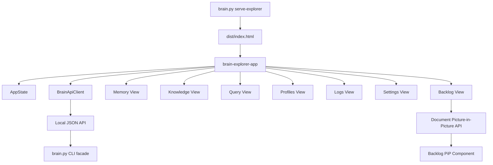

# Frontend Architecture

## Overview

The frontend is a static TypeScript source tree compiled into `dist/`. It uses native Custom Elements, ES module
source files, external CSS, and a local TypeScript compiler.

## Component Diagram

## `src/app.ts`

**What It Does:** Bootstraps the browser application by creating `BrainApiClient` and `AppState`.

**Used By:** `dist/brain-explorer.js` after the build step.

**Contract:** The module does not call the API directly. It wires dependencies into `brain-explorer-app`.

## `src/presentation/components/app-shell.ts`

**What It Does:** Owns the sticky header, navbar, theme toggle, route captions, and route mounting.

**Used By:** `src/app.ts`.

**Contract:** Routes are local presentation state only. Mounted views receive `{ api, state }` context.

## `src/infrastructure/api/brain-api-client.ts`

**What It Does:** Wraps browser `fetch()` calls to the local Brain Explorer API.

**Used By:** Presentation Web Components.

**Contract:** Every method returns the server JSON envelope and never shells out from the browser.

The client may attach `X-Workspace-Root` after the user selects a project from
the core-provided projects list. Changing the selection clears browser request
caches. The server remains authoritative and rejects paths that are not
registered consumers of the current agent core.

## Multi-Consumer Workspace Contract

One Explorer frontend and server instance belongs to one agent core. The project
selector lists `core/configs/brain_mirrors.json`; each option represents one
WoSP owned by that agent. Global views continue to use core state, while local
logs, backlog, attachments, source registry, vectors, and knowledge use the
selected consumer's `$agent` directory.

## Strict Type Boundary

`tsconfig.json` enables `strict`, `noUncheckedIndexedAccess`, and `noImplicitOverride` for the shared DTOs,
`BrainApiClient`, and `AppState`. `npm.cmd run typecheck` validates this browser/API boundary before every
`npm.cmd run verify` bundle. The component layer is being migrated incrementally under backlog task `t54`; it is not
silently excluded by weakening the compiler options.

## `src/presentation/components/backlog-pip.ts`

**What It Does:** Owns the compact, interactive backlog surface rendered inside a native Document Picture-in-Picture window.

**Used By:** `BacklogView`, which calls `window.documentPictureInPicture.requestWindow()` directly from the user gesture and mounts this already-registered Custom Element in the returned window document.

**Contract:** Task expansion and the create-task icon are local component interactions. The PiP component never substitutes an in-app floating panel; unsupported browsers leave the PiP control unavailable. Its `onAddTask` callback resolves to `{ ok, tasks?, message? }`: a successful result supplies the refreshed task list and returns the PiP from the creation form to its own list. Failed results keep the form open with its draft and a local error message.

## Backlog State Contract

`BacklogView` reads the durable `show-backlog` CLI projection through the local facade. The browser never edits a
legacy backlog file or opens the SQLite database directly. It requests the complete projection for tree navigation,
while the CLI still offers a compact pending-only view by default.

## `build/build-brain-explorer.mjs`

**What It Does:** Bundles TypeScript-compatible ES modules and CSS imports into `dist/`.

**Used By:** `npm.cmd run build` and `npm.cmd run verify`.

**Contract:** It transpiles TypeScript through the local `typescript` dependency, then emits generated runtime
artifacts only under `dist/`.
