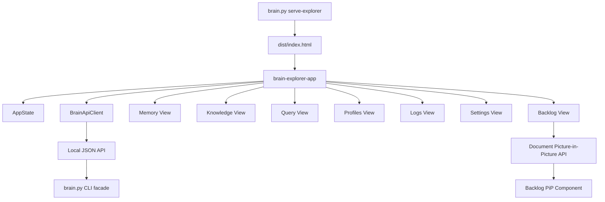

<!-- Author: Yoel David <yoeldcd@gmail.com> | X: https://x.com/SAY6267 -->

# Frontend Architecture

## Overview

The frontend is a static TypeScript source tree compiled into `dist/`. It uses native Custom Elements, ES module
source files, external CSS, and a local TypeScript compiler.

The presentation source follows one vertical slicing axis: `presentation/<feature>/<responsibility>/`. Each feature
owns its `layouts`, `view_models`, `controllers`, `projectors`, `normalizers`, `validators`, and other applicable
presentation responsibilities beneath the same feature root. Custom Elements that compose a screen live only in
the feature's `layouts/` directory. Genuinely cross-feature visual atoms, contracts, and utilities live beneath
`presentation/shared/`; transport DTOs remain in `application/contracts/`. The tree must never mix a competing
responsibility-first axis such as `presentation/view_models/<feature>` with feature-first folders at the same level.

## Component Diagram

## `src/app.ts`

**What It Does:** Bootstraps the browser application by creating `BrainApiClient` and `AppState`.

**Used By:** `dist/brain-explorer.js` after the build step.

**Contract:** The module does not call the API directly. It wires dependencies into `brain-explorer-app`.

## `src/presentation/shell/layouts/app-shell.ts`

**What It Does:** Owns the sticky header, navbar, theme toggle, route captions, and route mounting.

**Used By:** `src/app.ts`.

**Contract:** Routes are local presentation state only. Mounted views receive `{ api, state }` context. The component
consumes the typed route registry and does not own route configuration declarations.

## `src/presentation/shell/config/shell-routes.ts`

**What It Does:** Defines the immutable, ordered registry that maps application route identifiers to their labels,
icons, navigation visibility, and Custom Element selectors.

**Used By:** `BrainExplorerApp` for route validation, primary navigation rendering, fallback selection, and component
mounting.

**Contract:** This configuration module may import route-level Custom Elements to read their selectors, but it does
not render DOM, retain mutable UI state, or perform navigation. `DEFAULT_SHELL_ROUTE` is always the first member of
`SHELL_ROUTES`; every entry satisfies `ShellRouteViewModel`, and every id remains compatible with the application
`RouteId` contract.

## `src/application/shell/validators/route-id.ts`

**What It Does:** Narrows untrusted route strings to the closed application `RouteId` vocabulary without importing
the Presentation composition registry.

**Used By:** Feature layouts that receive route identifiers from DOM attributes or transport payloads.

**Contract:** Feature layouts must not import `presentation/shell/config/shell-routes.ts`. That registry imports every
route-level Custom Element and is therefore a composition root; importing it back from a route component creates a
runtime cycle. `isRouteId()` is the dependency-safe validation boundary for those consumers.

## `build/build-brain-explorer.mjs`

**What It Does:** Compiles the TypeScript entry graph and CSS import graph into the static Explorer distribution.

**Used By:** `npm run build` and the final stage of `npm run verify`.

**Contract:** The JavaScript bundler tracks the ordered module-expansion stack and fails with the complete source
cycle when a runtime import returns to an active module. Circular dependencies are rejected instead of being emitted
as mutually recursive lazy-module initializers, because that generated shape overflows the browser call stack before
the shell can mount. Syntax validation alone is not evidence of a runnable bundle; the dependency-cycle gate is part
of the build contract.

`src/presentation/shell/controllers/shell-keyboard-controller.ts` owns the global search-shortcut decision and
focus behavior. `BrainExplorerApp` owns listener lifecycle and delegates each keyboard event with its host element;
the controller retains no global or component state.

## `src/infrastructure/shared/http/clients/brain-api-client.ts`

**What It Does:** Wraps browser `fetch()` calls to the local Brain Explorer API.

**Used By:** Presentation Web Components.

**Contract:** Every method returns the server JSON envelope and never shells out from the browser. The client is a
cross-feature HTTP transport adapter, so it lives beneath the explicit Infrastructure `shared/http/clients`
boundary rather than masquerading as an application feature.

The client may attach `X-Workspace-Root` after the user selects a project from
the core-provided projects list. Changing the selection clears browser request
caches. The server remains authoritative and rejects paths that are not
registered consumers of the current agent core.

## Multi-Consumer Workspace Contract

One Explorer frontend and server instance belongs to one agent core. The project
selector lists `core/configs/brain_mirrors.json`; each option represents one
WoSP owned by that agent. Global views continue to use core state, while local
logs, backlog, attachments, source registry, vectors, and knowledge use the
selected consumer's `$agent` directory.

## Strict Type Boundary

`tsconfig.json` covers every `src/**/*.ts` module and enables the complete strict contract: `strict`,
`noImplicitAny`, `strictNullChecks`, `strictFunctionTypes`, `strictPropertyInitialization`, `noImplicitReturns`,
`noFallthroughCasesInSwitch`, `noUncheckedIndexedAccess`, `exactOptionalPropertyTypes`, and `noImplicitOverride`.
`npm.cmd run typecheck` validates the entire browser source tree before every `npm.cmd run verify` bundle. Source
modules may not bypass that boundary with `@ts-nocheck`, compiler exclusions, weakened flags, or untyped fallback
contracts.

## Dead-Code Dependency Gate

`tsconfig.json` enables `noUnusedLocals` and `noUnusedParameters`, so private members, local declarations, imports,
and parameters without executable consumers fail the normal typecheck. `build/audit-dead-code.mjs` complements the
compiler by using the TypeScript semantic model to build module and symbol dependency graphs. It rejects duplicate
exports, source modules without an importing dependent, and exported declarations without at least one semantic
reference. `src/app.ts` is the sole explicit module-graph root because the HTML/build pipeline executes it directly.

`npm run audit:dead-code` is a required stage of `npm run verify`. New exceptions must not be hidden in an allowlist:
an element either needs a real consumer, must become an explicit application entry point, or must be removed.

## Semantic JSDoc Pipeline

`build/format-jsdoc.mjs` parses only `src/**/*.ts` with the TypeScript AST. Build utilities, prompt templates, and
documentation tooling are outside that source boundary, which prevents generated JSDoc from being applied to the
JSDoc generator or auditor. For each undocumented module or declaration, and for each existing callable contract
with missing parameter or return semantics, the formatter extracts the exact recognized code fragment, signature,
owner, file, parameter names, and return requirement.

Each recognized fragment produces one OpenRouter request to the `memory.text_model` configured in
`core/configs/brain_configs.json`. `build/templates/jsdoc-semantics.prompt.txt` restricts Gemma 4 to returning a
small JSON semantic contract: a summary, descriptions keyed by exact parameter name, and an optional return
description. The model never owns comment layout or JSDoc syntax. The formatter validates that JSON and composes
the comment structures deterministically. Every JSDoc block uses canonical multiline form. The TypeScript
`TypeChecker` independently resolves property, parameter, and return types so the local composer writes
`@type {Type}`, `@param {Type} name`, and `@returns {Type}` without asking the model to infer compiler-owned facts. Responses are cached under the ignored
`.tmp/` directory by a hash of their source context, so an interrupted pass resumes safely and changed code cannot
reuse stale semantics. The configured API key is resolved through the Brain secret resolver and is never written to
the cache or generated source.

`npm run format:jsdoc` performs the semantic generation pass. `npm run audit:jsdoc` independently associates
comments with their declarations through the TypeScript parser and rejects one-line JSDoc, missing module or
declaration coverage, untyped properties, untyped parameters, untyped returns, and undocumented named parameters.
It is a required `npm run verify` gate. The formatter also removes duplicate parameter and return tags mechanically while preserving the first authored contract. A second formatter pass must make no changes before the audit can be accepted as complete.

## Presentation Contract Ownership

Each feature's `src/presentation/<feature>/view_models/` directory owns immutable, view-ready shapes consumed by its
layouts. `src/presentation/shared/view_models/component-context-view-model.ts` describes the injected
`BrainApiClient` and `AppState` dependencies used across features. Feature-specific models describe only values
needed for rendering and interaction state. Runtime values read from DOM controls or loosely shaped route targets
must be narrowed through a feature validator before they enter those models.

Application boundary data is vertically owned by the feature that consumes it. Response payloads live under
`src/application/<feature>/dtos/responses/`, normalized mutation inputs live under
`src/application/<feature>/dtos/requests/`, and genuinely cross-feature envelopes live under
`src/application/shared/contracts/`. The former `src/application/contracts/api-dtos.ts` monolith is intentionally
absent: it mixed unrelated feature vocabularies and made every transport change appear globally coupled.

Presentation models may reference feature DTOs when their shape is intentionally identical, but components must not
redefine transport contracts locally. `BrainApiClient` imports each feature-owned payload from its application
boundary and supplies the shared `ApiResponse<TData>` envelope. This dependency direction keeps server evolution,
application adaptation, and browser rendering independently reviewable without creating a horizontal DTO dumping
ground.

## `src/presentation/backlog/layouts/backlog-pip.ts`

**What It Does:** Owns the compact, interactive backlog surface rendered inside a native Document Picture-in-Picture window.

**Used By:** `BacklogView`, which calls `window.documentPictureInPicture.requestWindow()` directly from the user gesture and mounts this already-registered Custom Element in the returned window document.

**Contract:** Task expansion and the create-task icon are local component interactions. The PiP component never substitutes an in-app floating panel; unsupported browsers leave the PiP control unavailable. Its `onAddTask` callback resolves to `{ ok, tasks?, message? }`: a successful result supplies the refreshed task list and returns the PiP from the creation form to its own list. Failed results keep the form open with its draft and a local error message.

The component consumes its documented contracts from
`src/presentation/backlog/view_models/backlog-pip-view-model.ts`. The runtime priority guard lives in
`src/presentation/backlog/validators/backlog-pip-priority.ts`; this prevents arbitrary DOM strings from being
asserted into the closed application priority union.

## Backlog State Contract

`BacklogView` reads the durable `show-backlog` CLI projection through the local facade. The browser never edits a
legacy backlog file or opens the SQLite database directly. It requests the complete projection for tree navigation,
while the CLI still offers a compact pending-only view by default.

## Logs Presentation Parsing

`src/presentation/logs/formatters/log-entry-parser.ts` owns the deterministic conversion from `LogEntryPayload`
transport records to `ParsedLogEntryViewModel` values. It derives sortable timestamps, applies inclusive hour
filters, discovers safe picture filenames, and orders the resulting projection. The Logs Web Component supplies the
current immutable filter context and renders the returned values; it does not own parsing or filename-recognition
rules. This boundary keeps transport normalization independently testable and prevents non-component formatting
logic from accumulating inside feature `layouts/` directories.

`src/presentation/logs/projectors/log-date-tree-projector.ts` owns calendar grouping and recursively projects the
flat log index into shared year, month, day, and terminal-entry nodes. The component delegates to this pure projector
instead of retaining mutable grouping helpers.

## Repository Ignore Boundaries

The repository-root `.gitignore` anchors runtime-owned `/memory/` and `/pictures/` directories to the root. Nested
source directories named `memory` or `pictures` are therefore ordinary versioned code. Layouts use the canonical
paths `presentation/memory/layouts/` and `presentation/pictures/layouts/`; source structure
must not be renamed to work around an unanchored ignore rule.

## Memory Tree Projection

`src/presentation/memory/projectors/memory-tree-projector.ts` owns construction and read-only querying of the
dot-notated Memory hierarchy. Each instance represents an immutable path and filter snapshot and exposes branch,
leaf, parent, visibility, and ordering operations. `MemoryView` retains only selection and expanded-node UI state;
it does not implement path normalization or recursive filter algorithms inside the component module.

## Knowledge Payload Normalization

### `src/presentation/knowledge/projectors/knowledge-source-tree-projector.ts`

**What It Does:** Projects global memory, pictures, local logs, and avatar-message sessions into the shared Knowledge source-tree contract. It owns hierarchy construction and canonical source metadata, leaving `KnowledgeView` responsible for data acquisition, selection, and navigation.

**Used By:** `KnowledgeView` whenever the Knowledge layout renders or refreshes its source navigator.

**Contract:** `KnowledgeSourceTreeProjector.project()` accepts immutable source collections plus graph-count and color policies. It returns documented `KnowledgeTreeNode` roots without mutating the supplied records or performing DOM, routing, or network operations.

### `src/presentation/knowledge/state/knowledge-canvas-state.ts`

**What It Does:** Owns the protected, typed state shared by the Knowledge canvas collaborators and declares the abstract hooks implemented by the concrete layout.

**Used By:** The canvas renderer, canvas interaction controller, tree interaction controller, and `KnowledgeView` inheritance chain.

**Contract:** Holds graph, viewport, selection, source, and lifecycle state only. It performs no rendering, data access, or event binding.

### `src/presentation/knowledge/renderers/knowledge-canvas-renderer.ts`

**What It Does:** Draws graph nodes, relations, labels, badges, visible regions, and camera projections on the existing canvas.

**Used By:** `KnowledgeCanvasInteractionController` through protected inheritance.

**Contract:** Preserves the established canvas geometry and visual classes while delegating pointer decisions and full-layout rendering through abstract state hooks.

### `src/presentation/knowledge/controllers/knowledge-canvas-interaction-controller.ts`

**What It Does:** Coordinates pointer gestures, hit testing, camera animation, node/relation selection, inspector refreshes, and partial DOM event binding.

**Used By:** `KnowledgeTreeInteractionController`.

**Contract:** Mutates only the shared typed canvas state and calls renderer or facade hooks; it does not fetch records or replace the Knowledge page template.

### `src/presentation/knowledge/controllers/knowledge-tree-interaction-controller.ts`

**What It Does:** Coordinates initial data loading and source-tree selection, toolbar actions, route navigation, and tree model binding.

**Used By:** `KnowledgeView`, which is the concrete custom element.

**Contract:** Uses application API and route-state dependencies inherited from `KnowledgeCanvasState`, then delegates normalization and full rendering to abstract facade hooks.

### `src/presentation/knowledge/layout_engines/knowledge-graph-layout-engine.ts`

**What It Does:** Positions connected components and unlinked domain groups without owning DOM or component lifecycle.

**Used By:** `KnowledgeView.prepareGraph()` after graph projection and connectivity sizing.

**Contract:** Accepts typed nodes and edges, mutates only node coordinates, and returns no UI markup or side effects.

### `src/presentation/knowledge/renderers/knowledge-inspector-renderer.ts`

**What It Does:** Produces the unchanged empty, node, and relation inspector markup from an explicit render contract.

**Used By:** `KnowledgeView.renderDetails()`.

**Contract:** Receives immutable graph collections and source resolver callbacks. It preserves existing CSS classes and `data-action` attributes and never mutates selection or navigation state.

`src/presentation/knowledge/normalizers/knowledge-graph-normalizer.ts` owns the conversion from untrusted knowledge
command payloads to the closed `KnowledgeRecord` and `KnowledgeRelation` presentation contracts. Its immutable
context declares the active query mode, fallback scope, and shared stable-identifier factory. The normalizer
preserves the existing interpretation of entity, class, and mixed result arrays; explicit and discovered relation
arrays; class markers; memory-backed dotted domains; source context; confidence metadata; and fallback endpoint
labels. It does not render, position graph nodes, inspect DOM state, or mutate the Knowledge Web Component.

`KnowledgeView` creates a normalizer from its current state snapshot and consumes only the resulting typed
collection. `build/test-knowledge-normalizer.mjs` is a non-regression contract in `npm run verify`: it protects
entity/class filtering, scope fallback, memory-domain derivation, stable identifiers, predicates, and the legacy
fallback behavior for incomplete explicit relations. Changes to normalization must update this contract only when
the product behavior is intentionally changed; architectural extraction alone must not suppress data.

## `build/build-brain-explorer.mjs`

**What It Does:** Bundles TypeScript-compatible ES modules and CSS imports into `dist/`.

**Used By:** `npm.cmd run build` and `npm.cmd run verify`.

**Contract:** It transpiles TypeScript through the local `typescript` dependency, then emits generated runtime
artifacts only under `dist/`.
