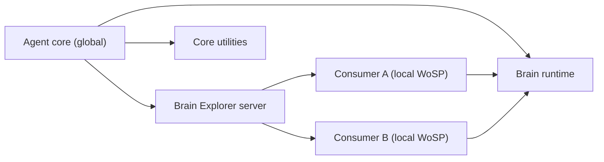

# Core documentation

This is the canonical documentation entrypoint for an agent core.

## Mental model

One `core/` belongs to one agent. It is global across that agent's workspace
operating scopes (WoSPs). Each consumer is local to one workspace and contains
only a launcher plus workspace-owned data. Brain Explorer can manage every
registered consumer from one server because all mirrors share the same core.

See [architecture and ownership](architecture.md) for the full boundary
contract.

## Directory map

| Path | Responsibility |
|---|---|
| `core_cli.py` | Creates `$agent/scripts/brain.py` consumers. |
| `requirements.txt` | Canonical Python dependency installation entrypoint. |
| `brain/` | Python runtime, CLI commands, and domain services. |
| `brain_explorer/` | Single-server UI and APIs for all registered mirrors. |
| `configs/` | Versioned core configuration owned by the agent. |
| `database/` | Fixed core stores and versioned operational registries. |
| `assets/avatar/` | Canonical avatar state images for this agent. |
| `utilities/` | Core-owned utilities with dedicated contracts. |
| `documentation/` | Cross-subsystem architecture and operating policy. |

## Configuration contracts

| File | Contract |
|---|---|
| `configs/brain_configs.json` | Shared model settings and canonical `agent_dir`. |
| `configs/brain_avatar_config.json` | Voice and avatar runtime settings. |
| `configs/brain_mirrors.json` | Consumers visible to the shared Explorer server. |

Configuration belongs to the core, never to a consumer. Brain resolves its
configuration, assets, utilities, and fixed stores relative to its containing
`core/` directory. The configured `agent_dir` is the only canonical pointer to
agent-authored global state such as `memory/`, `snippets/`, `skills/`, and
`AGENT.md`.

Legacy configurable paths for the knowledge database and memory vectorstore do
not exist. Their locations are fixed directory contracts below
`core/database/`.

## Runtime stores

| Scope | Location | Examples |
|---|---|---|
| Global agent | `core/database/` | Knowledge, global sources, vectorstores, avatar state. |
| Local consumer | `<workspace>/$agent/database/` | Logs, backlog, local sources, local knowledge and vectors. |
| Agent-authored | `<agent_dir>/` | Memory, snippets, skills, workflows, prompt. |

Mutable databases and caches are private and ignored. Declarative settings and
registries remain versionable, including
`database/instruction_mirrors/agent_prompt_mirrors.txt`.

## Entrypoints

`core/core_cli.py create-brain <workspace-root>` copies a relocatable launcher
to `<workspace-root>/$agent/scripts/brain.py`. `CORE_ROOT` in that consumer is
only the bootstrap path used to import Brain. It is not a second global data
root and does not change the configured agent identity.

The standalone `create_agent_directory` utility creates an entirely new agent
directory and cloned core seed. It is intentionally not registered as a Brain
command because its responsibility is to create a new ownership boundary, not
operate the current one. Its standalone `update-agent` command content-syncs
only `brain/` and `brain_explorer/` from the utility's containing core into an
existing clone; private state and identity remain untouched.

Avatar service host/port and process leases are core-scoped. Explorer processes
are isolated by their imported core and must use distinct listening ports when
multiple agent cores are served at the same time.

## Services

Brain Explorer is the normal interface for inspecting memory, knowledge,
profiles, logs, and documentation across every registered consumer. The avatar
service is also core-owned and reads canonical assets and voice configuration
from the same core.

## Utilities

| Utility | Brain command | Documentation |
|---|---|---|
| Documentation Utils | `wiki` | [`documentation_utils`](../utilities/documentation_utils/documentation/README.md) |
| Prompt Propagator | `propagate-agent-prompt` | [`propagate_agent_prompt`](../utilities/propagate_agent_prompt/documentation/README.md) |
| Agent Directory Factory | Standalone `create-agent` / `update-agent` | [`create_agent_directory`](../utilities/create_agent_directory/documentation/README.md) |

Documentation Utils remains callable, but core documentation is served by
Brain Explorer and does not keep generated wiki trees. See the
[delivery policy](wiki-policy.md).

## Subsystem references

- [Brain documentation](../brain/documentation/README.md)
- [Brain Explorer documentation](../brain_explorer/documentation/README.md)
- [Brain command map](../brain/README.md)

## Safety invariants

- A consumer never owns or overrides core configuration.
- Core code does not discover legacy `snippets/brain` or root `database/`
  locations.
- New agents receive empty runtime stores and generic instructions.
- Clone updates are content-aware and cannot cross the `brain/` and
  `brain_explorer/` code boundaries.
- Personal memory, prompt mirrors, databases, and avatar state are never copied
  into another agent seed.
- Generated wiki output stays out of version control.
