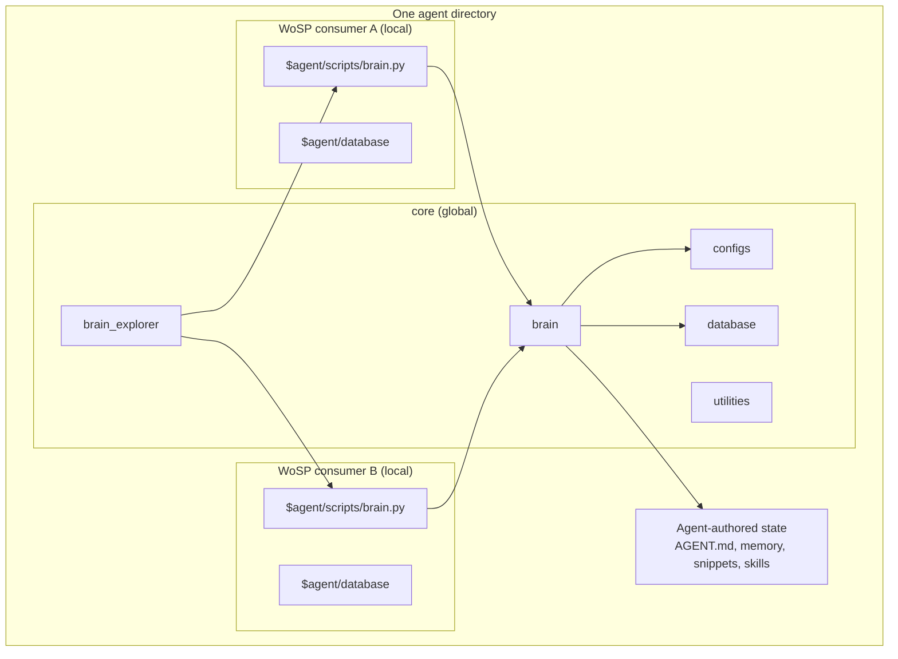

# Architecture and ownership

## Boundary model

The core is both the executable Brain and the global state boundary of one
agent. A consumer is a local projection that provides `WORKSPACE_ROOT` and a
stable CLI facade for one workspace.

## Path resolution

The installed Brain package derives its core container from its own source
location. From that root it resolves `configs/`, `database/`, `assets/`, and
`utilities/`. No machine-specific absolute core path is embedded in the source
tree.

Consumer launchers contain a relative `CORE_ROOT` expression solely to place
`core/brain/src` on Python's import path. They also expose their workspace as
`WORKSPACE_ROOT`. Global authored state is resolved only through `agent_dir` in
`core/configs/brain_configs.json`.

## Global and local data

Global operations are stable when the selected mirror changes. These include
memory, profiles, the knowledge graph, shared source registry, avatar state,
prompt propagation, and core configuration.

Local operations follow the selected consumer. These include workspace logs,
backlog tasks, local sources, local knowledge, and local vectorstores.

## Explorer mirror routing

`brain_mirrors.json` is a core-owned catalog. Explorer starts once, validates a
requested mirror against that catalog, and sets only the request's local
workspace context. It does not swap cores or agent identities.

## Seed boundary

Creating a consumer and creating an agent are different operations:

1. `core_cli.py create-brain` adds a local facade for this existing agent.
2. `create_agent_directory.py` creates a new `@agent/` root, clones the
   versioned runtime seed, writes default configuration for that new identity,
   and creates empty stores plus the special `memory/profiles`, `memory/diary`,
   `$user`, and `.tmp` domains.

The factory's `update-agent` command is a narrower lifecycle operation. It
mirrors only content differences in `brain/` and `brain_explorer/` from its own
containing core. It removes code files that no longer exist upstream while
leaving configuration, databases, assets, utilities, prompts, and authored
state outside the update boundary.

The agent factory must exclude live databases, registered mirrors, personal
portraits, caches, secrets, and generated documentation output. Versioned
`avatar_<state>` presentation assets are part of the seed because the avatar
window requires them before any private avatar storage exists.

## Multi-core services

Explorer has no process-global singleton: each core resolves its own static
bundle, agent directory, stores, and mirror registry. Separate cores can serve
simultaneously by binding different `serve-explorer --port` values.

The avatar daemon endpoint belongs to `brain_avatar_config.json`. New agent
seeds receive a stable per-agent loopback port, and Windows daemon/window
singleton leases include an opaque hash of the physical core root. Daemon
health also carries that core identity, preventing one core from accepting a
different core's healthy service after a port collision.
